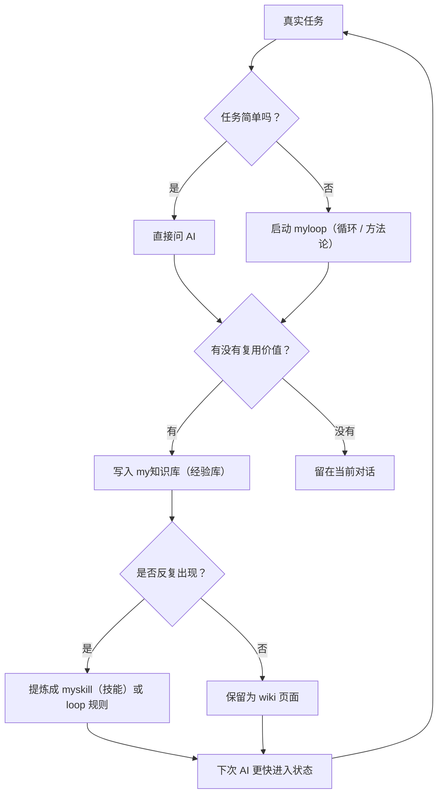

# Personal AI OS（个人 AI 操作系统）

这是一个可以迁移到新电脑的个人 AI 操作系统模板。它不是一个单独软件，而是一套让人和 AI 一起工作的文件系统：

```text
myskill（技能入口）
-> myloop（循环方法论）
-> my知识库（Markdown 文档 / wiki 经验库）
-> memory（长期记忆）
-> better AI use（更会用 AI）
-> faster learning（学习更快）
```

核心目标很简单：日常工作用 AI 提效，提效过程中产生经验，经验沉淀成 Markdown（文档）/ wiki（维基），重复流程升级成 skill（技能）或 loop（循环），下次再用 AI 时更快、更稳。



## 上半部分：给人看的用法

### 1. 三个文件夹分别是什么

| 层 | 文件夹 | 白话理解 | 适合放什么 |
| --- | --- | --- | --- |
| skill（技能） | `myskill/` | 像遥控器或快捷入口 | `/myloop`、`/my知识库` 这种一句话能叫出来的入口 |
| loop（循环） | `myloop/` | 像方法论和复杂任务流程 | 目标对齐、上下文收集、探索、评价、复盘、停止条件 |
| md/wiki（文档 / 经验库） | `my知识库-template/` | 像可检索的经验库 | 经验总结、排查清单、工具用法、复盘结论 |

不要把三层混在一起：

- 只是一句触发入口，放 `myskill/`。
- 是复杂任务怎么一步步推进，放 `myloop/`。
- 是已经解决过的问题和经验，放 `my知识库-template/` 派生出的知识库。

### 2. 推荐安装位置

把这个仓库放在桌面最容易记：

```bash
cd ~/Desktop
git clone git@github.com:你的用户名/personal-ai-os.git
```

然后建议建立三份本地工作目录：

```text
~/Desktop/myskill
~/Desktop/myloop
~/Desktop/my知识库
```

如果你想直接用仓库里的模板作为源文件，可以执行安装脚本：

```bash
cd ~/Desktop/personal-ai-os
bash install/bootstrap-desktop-layout.sh
```

脚本会做三件事：

1. 如果桌面还没有对应目录，就复制模板过去。
2. 如果桌面已有目录，不会覆盖，会提示你手动合并。
3. 保持 `my知识库` 使用模板骨架，不带任何真实私人内容。

### 3. 给 Codex / Claude Code 安装技能入口

Codex 和 Claude Code 都可以通过 skill（技能）入口找到桌面目录。

安装到 Codex：

```bash
cd ~/Desktop/personal-ai-os
bash install/install-codex-skills.sh
```

安装到 Claude Code：

```bash
cd ~/Desktop/personal-ai-os
bash install/install-claude-skills.sh
```

安装后可用这些话测试：

```text
/myloop 只验证你能不能读到本地 myloop，不要创建任务。
```

```text
/my知识库 只验证你能不能读到本地知识库规则，不要写文件。
```

### 4. 日常怎么用

#### 简单任务

直接问 AI，不用启动 loop（循环），也不用写知识库。

例子：

```text
帮我解释一下这个报错是什么意思。
```

#### 复杂任务

使用 `myloop`。它适合需要多轮分析、收集上下文、验证和复盘的任务。

例子：

```text
/myloop 目标：帮我梳理这个项目的性能瓶颈。任务地址：~/Desktop/my-project
```

#### 有复用价值的经验

使用 `my知识库`。它适合把已经解决的问题沉淀成下次可查的经验。

例子：

```text
/my知识库 把刚才解决的问题沉淀进我的知识库，注意脱敏。
```

### 5. 每天 15 分钟怎么形成飞轮

不要把“每日 AI 飞轮”做成空泛打卡。每天只做一个小闭环：

1. 找一个今天真实卡住的点。
2. 让 AI 帮你解决或优化。
3. 问 AI：这件事下次还会不会遇到？
4. 如果会，沉淀到 `my知识库`。
5. 如果同类流程出现 3 次，再考虑升级成 `myskill` 或 `myloop` 规则。

判断口诀：

```text
一次性问题：留在对话。
下次还会用：写进 wiki。
反复要照做：升级成 skill。
复杂要推进：升级成 loop。
```

### 6. 什么不要上传到 GitHub

即使仓库是 private（私有），也不要上传这些内容：

- token（令牌）、key（密钥）、密码、私钥。
- 真实账号、机器地址、内网地址。
- 公司内部资料、客户资料、未脱敏会话。
- Codex / Claude Code 的完整 session（会话）记录。
- `~/.codex`、`~/.claude` 里的认证、缓存、历史文件。
- `my知识库/sources/` 里的原始材料，除非你确认已经脱敏。

这个仓库默认只放模板和骨架，不放你的真实知识库内容。

### 7. 仓库结构

```text
personal-ai-os/
  README.md
  AGENTS.md
  CLAUDE.md
  myskill/
  myloop/
  my知识库-template/
  automations/
  examples/
  install/
  snippets/
```

- `AGENTS.md`：给 Codex / 其他代码 Agent（智能体）看的仓库规则。
- `CLAUDE.md`：给 Claude Code 看的仓库规则。
- `automations/`：自动化提示词模板，例如全盘优化晨报。
- `examples/`：脱敏示例，让人知道好文档长什么样。
- `snippets/`：可复制到个人全局配置里的简短规则。

---

## 下半部分：给 AI 看的操作规则

### 1. 总原则

你正在处理的是一个个人 AI 操作系统模板仓库。目标不是完成一次性问答，而是帮助用户建立可迁移、可迭代、可复用的个人工作系统。

请默认使用中文回答。英文专有名词后补中文说明，例如 skill（技能）、loop（循环）、memory（记忆）、wiki（维基）。复杂概念优先用白话、类比、例子和 Mermaid（流程图）解释。

### 2. 读文件顺序

当任务涉及本仓库时，先按这个顺序读：

1. `README.md`
2. `AGENTS.md`
3. 用户明确提到的目录规则
4. 对应层的入口文件：
   - `myskill/*/SKILL.md`
   - `myloop/README.md`
   - `myloop/task-initializer.md`
   - `myloop/ai-loop-mini2/loop.md`
   - `my知识库-template/AGENTS.md`
   - `my知识库-template/wiki/README.md`

不要一上来全文扫描所有文件。先索引，后深入。

### 3. 三层路由规则

收到一个任务后，先判断它属于哪一层：

| 任务类型 | 应进入哪一层 | 行为 |
| --- | --- | --- |
| 用户要一个稳定触发入口 | `myskill/` | 修改或新增 skill（技能）入口 |
| 用户要复杂任务方法论 | `myloop/` | 修改 loop（循环）模板、初始化规则或评价规则 |
| 用户要沉淀经验 | `my知识库-template/` 或用户本地 `my知识库` | 新增或更新 wiki（维基）页面和索引 |
| 用户要长期偏好 | `AGENTS.md` / `CLAUDE.md` / `snippets/` | 只写稳定、反复适用的规则 |
| 用户只是一次性问题 | 当前对话 | 不要强行沉淀 |

### 4. myskill（技能）规则

`myskill/` 只做稳定入口，不复制复杂流程全文。

正确做法：

- skill（技能）里写清楚触发词、稳定路径、必须先读哪些文件。
- 真实流程继续放在 `myloop/` 或 `my知识库` 中。
- 如果路径改了，更新 skill 中的路径和说明。

错误做法：

- 把整个 loop（循环）流程复制进 `SKILL.md`。
- 在 skill 中写大量临时任务细节。
- 让 skill 默认执行高风险外部操作。

### 5. myloop（循环）规则

`myloop/` 是复杂任务方法论层。默认模板是：

```text
myloop/ai-loop-mini2/loop.md
```

适合使用 loop（循环）的场景：

- 目标不完全清楚，需要先对齐。
- 资料多，需要分轮读上下文。
- 需要验证、评价、复盘。
- 可能跨多轮、跨工具、跨文件。

真实任务不要直接写进母模板。应按 `myloop/task-initializer.md` 在目标项目下生成任务专用目录，例如：

```text
目标项目/.project-loops/任务名/
```

修改 loop 模板时，必须同步检查：

- `myloop/README.md`
- `myloop/task-initializer.md`
- 对应模板的 `loop.md`
- 对应模板的 `修改记录.md`
- 根目录 `myloop/00-change-log/change-log.md`

### 6. my知识库（Markdown / wiki）规则

`my知识库-template/` 是骨架，不是用户真实知识库。迁移到本机后，真实知识库通常叫：

```text
~/Desktop/my知识库
```

知识库维护顺序：

1. 先读 `AGENTS.md`。
2. 再读 `index.md`。
3. 再读 `wiki/README.md`。
4. 再读相关分类索引。
5. 最后读相关 wiki 页或 source（来源）。

写入规则：

- 原始资料放 `sources/分类/主题/source.md`。
- 提炼后的结论放 `wiki/分类/页面.md`。
- 不确定分类先放 `inbox/`。
- 新增或移动页面后更新根 `index.md`、分类 `index.md`、`log.md`。
- 敏感信息不要扩散到 wiki 页。

### 7. 安全边界

修改前必须确认的情况：

- 删除、移动、重命名大量文件。
- 改目录结构。
- 覆盖用户已有 `myskill`、`myloop`、`my知识库`。
- 上传、发布、推送到远端。
- 写入 token（令牌）、key（密钥）、密码、私钥。
- 读取明显无关的隐私目录。
- 把真实 session（会话）或 memory（记忆）完整上传。

如果用户明确要求推送到 GitHub，也要先做敏感信息扫描。

推荐扫描命令：

```bash
rg -n "ghp_|token|key|password|密码|密钥|令牌|私钥|BEGIN .*PRIVATE KEY|内网|账号|/Users/" .
```

### 8. 全盘优化自动化

`automations/全盘优化晨报.prompt.md` 是只读晨报提示词。它的目标是每天看前一天 AI 使用记录，提出待确认建议。

默认行为：

- 只读审查。
- 不自动改 `my知识库`、`myloop`、`myskill`。
- 输出像晨报，不像审计报告。
- 必须按 `loop`、`skill`、`md/wiki` 三层给建议。
- “今日 15 分钟行动”必须结合真实痛点和 AI 灵感，不写空泛口号。

### 9. 输出风格

面向用户输出时：

- 尽量中文。
- 先给结论，再给依据和下一步。
- 复杂概念用 Mermaid（流程图）辅助。
- 不要一上来堆抽象名词。
- 每次回答最后加“白话总结”。

## 白话总结

这个仓库就是把“怎么用 AI 越用越强”变成一套可复制文件夹：`myskill` 负责叫出能力，`myloop` 负责复杂任务怎么推进，`my知识库` 负责把经验留下来。人负责判断和确认，AI 负责记流程、找经验、推进任务、做复盘。
