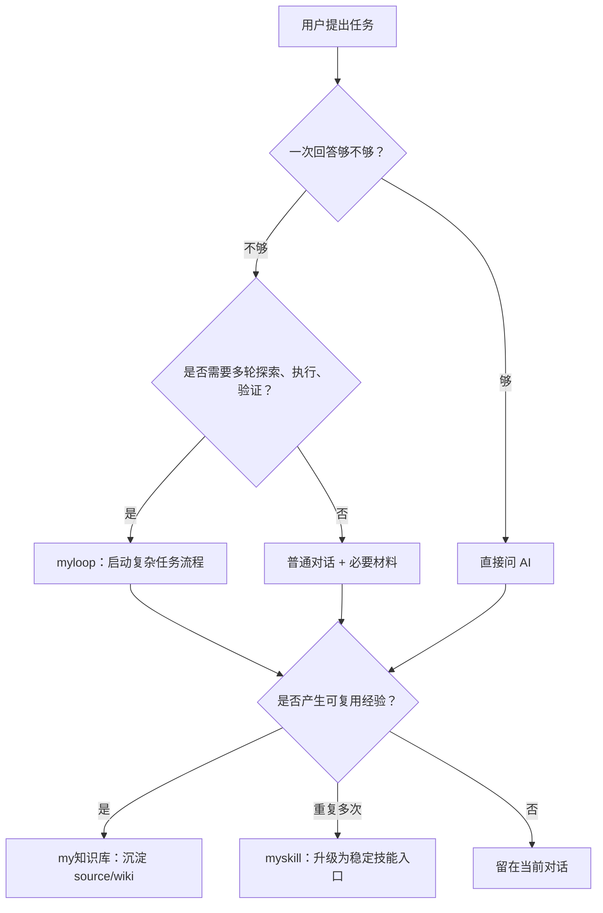

# Personal AI OS

这是一个脱敏版个人 AI 操作系统（Personal AI OS）仓库，用来公开/备份 `myskill`、`myloop`、`my知识库` 三层体系的架构和通用流程。

## 上传范围

本仓库包含：

- `docs/个人AI自动化系统使用说明.md`：给其他 Agent（智能体）阅读的总说明。
- `myloop/`：Loop（循环）工作流模板与场景 Loop，已排除本地 `.git/`、`.DS_Store` 和 PDF 产物。
- `myskill/`：通用 skill（技能）入口模板，包括 `myloop`、`my知识库`、`skill-check`、`business-skill-template`，使用 `$HOME` 路径，不绑定个人机器。
- `my知识库-template/`：可复刻的空知识库骨架，包含 AGENTS、index、导航、wiki 规范、templates 和维护文档。
- `architecture/my知识库架构.md`：知识库架构说明，不包含私有知识库正文。
- `architecture/myskill架构.md`：skill（技能）入口层架构说明。
- `install/`：把 `myskill/` 软链接到 Claude Code / Codex skill 目录的安装脚本。
- `snippets/`：可复制到项目里的 `AGENTS.md` / `CLAUDE.md` 示例片段。

本仓库不包含：

- `my知识库/sources/` 的原始资料正文。
- `my知识库/wiki/` 的私有经验正文。
- 具体业务 skill 的真实正文，例如操作某个公司工具、机器人或内部系统的 skill。
- token（令牌）、key（密钥）、密码、私钥、完整内网地址、账号、SSH 信息。

## 三层模型

```text
myskill = 技能入口层，负责“怎么启动”
myloop = 复杂任务流程层，负责“怎么推进”
my知识库 = 经验沉淀层，负责“怎么复用”
```



## 推荐使用方式

1. 先读 `docs/个人AI自动化系统使用说明.md`。
2. 想理解复杂任务怎么跑，读 `myloop/README.md` 和 `myloop/task-initializer.md`。
3. 想复刻知识库结构，复制 `my知识库-template/`，再读 `my知识库-template/AGENTS.md`。
4. 想复刻 skill 入口层，复制 `myskill/`，再读 `myskill/README.md`。
5. 想安装到本机，按需运行 `install/install-claude-skills.sh` 或 `install/install-codex-skills.sh`。

## 白话总结

这个仓库公开的是“可复刻骨架”：`myskill` 是入口，`myloop` 是复杂任务跑法，`my知识库-template` 是空经验库模板。真实历史记忆、私有 source/wiki 正文、具体业务 skill 没有上传。
