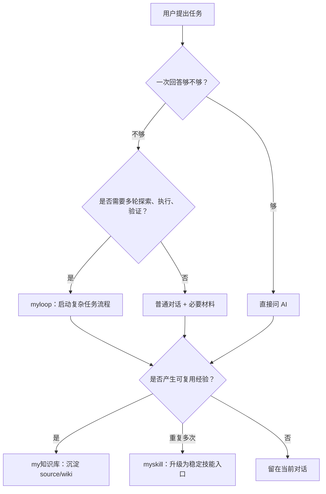

# Personal AI OS

这是一个脱敏版个人 AI 操作系统（Personal AI OS）仓库，用来公开/备份 `myskill`、`myloop`、`my知识库` 三层体系的架构和通用流程。

## 上传范围

本仓库包含：

- `docs/个人AI自动化系统使用说明.md`：给其他 Agent（智能体）阅读的总说明。
- `myloop/`：Loop（循环）工作流模板与场景 Loop，已排除本地 `.git/`、`.DS_Store` 和 PDF 产物。
- `architecture/my知识库架构.md`：只描述知识库架构，不包含私有知识库正文。
- `architecture/myskill架构.md`：只描述 skill（技能）入口层架构，不包含任何 `SKILL.md` 正文。

本仓库不包含：

- `my知识库/sources/` 的原始资料正文。
- `my知识库/wiki/` 的私有经验正文。
- `myskill/*/SKILL.md` 的真实技能内容。
- token（令牌）、key（密钥）、密码、私钥、完整内网地址、账号、SSH 信息。

## 三层模型

```text
myskill = 技能入口层，负责“怎么启动”
myloop = 复杂任务流程层，负责“怎么推进”
my知识库 = 经验沉淀层，负责“怎么复用”
```



## 推荐使用方式

1. 先读 `docs/个人AI自动化系统使用说明.md`。
2. 想理解复杂任务怎么跑，读 `myloop/README.md` 和 `myloop/task-initializer.md`。
3. 想复刻知识库结构，读 `architecture/my知识库架构.md`。
4. 想复刻 skill 入口层，读 `architecture/myskill架构.md`。

## 白话总结

这个仓库只公开系统架构和通用流程：`myskill` 是入口，`myloop` 是复杂任务跑法，`my知识库` 是经验沉淀方法。私有知识正文和真实技能正文没有上传。
