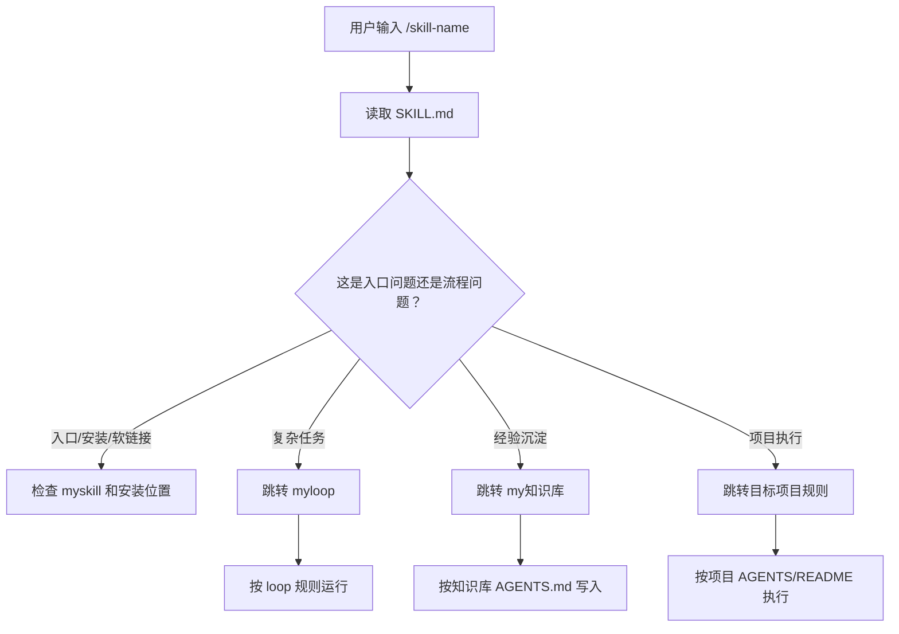

# myskill架构

> 这是脱敏架构说明，只描述 skill（技能）入口层的设计方法，不上传任何真实 `SKILL.md` 正文。

## 定位

`myskill` 是个人 AI 操作系统里的“技能入口层”。它像遥控器，负责让 Agent（智能体）知道该去哪里读真实流程。

它不应该承载完整业务流程。真实流程应放在：

- `myloop`：复杂任务、多轮执行、评价和复盘。
- `my知识库`：可复用经验、规则、排查清单和证据。
- 具体项目目录：项目自己的 `AGENTS.md`、`CLAUDE.md`、`README.md`、`docs/`。

## 推荐目录形态

```text
myskill/
├── Claude-Code配置说明.md       # 安装、软链接、排查说明
├── <skill-name>/
│   ├── SKILL.md                 # 短入口：触发词、稳定位置、边界
│   └── agents/
│       └── openai.yaml          # 可选元数据
├── <another-skill>/
│   ├── SKILL.md
│   └── agents/
│       └── openai.yaml
└── ...
```

## SKILL.md 应该写什么

一个好的 `SKILL.md` 应该短、稳、像路标。

建议包含：

- `name`：技能名。
- `description`：触发场景和关键词。
- Stable Locations（稳定位置）：真实流程在哪里。
- Runtime Workflow（运行流程）：最短执行步骤。
- Human Interaction Boundaries（需要问人的边界）。
- Design Rule（设计原则）：不要复制真实流程，运行时读取最新文件。

不建议包含：

- 大段业务正文。
- 大量私有知识库内容。
- 完整项目实现细节。
- token（令牌）、key（密钥）、密码、私钥。
- 会频繁变动的流程全文。

## skill 与真实流程的关系



## 安装与软链接思路

推荐让不同 Agent 共用桌面源文件，不要复制两份长期维护。

概念上：

```text
桌面源目录:
  /Users/<user>/Desktop/myskill/<skill-name>

Claude Code 可见目录:
  ~/.claude/skills/<skill-name> -> 桌面源目录

Codex 可见目录:
  ~/.codex/skills/<skill-name> -> 桌面源目录
```

这样更新桌面源文件后，不需要分别维护 Claude Code 和 Codex 两套 skill。

## skill-check 思路

建议保留一个只读自检 skill，用来检查：

- 桌面源目录是否存在。
- 安装目录软链接是否存在。
- 软链接是否指向预期源目录。
- `SKILL.md` 是否可读。
- 可选元数据文件是否存在。

默认只读，不自动修复。创建、删除、改软链接都要先问用户。

## 什么时候升级为 skill

适合升级：

- 同类任务重复多次。
- 输入、步骤、输出比较固定。
- 仅靠 wiki 阅读太慢。
- 希望 Agent 自动按流程执行。

不适合升级：

- 临时想法。
- 还没验证过的流程。
- 需要大量业务判断的任务。
- 已经由 loop 或 wiki 清楚承载的内容。

## 白话总结

`myskill` 不负责“干所有事”，只负责“把 Agent 带到正确入口”。skill 越短越稳，真实流程留给 `myloop`，可复用经验留给 `my知识库`。
