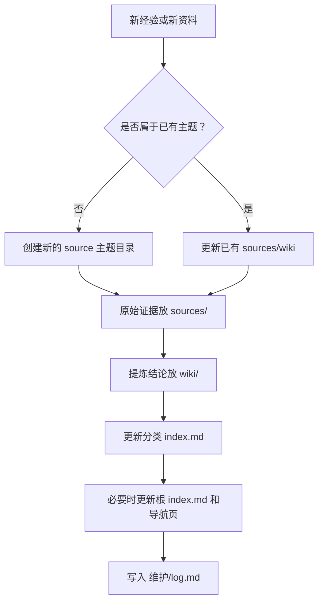

# my知识库架构

> 这是脱敏架构说明，只描述目录职责和写入流程，不包含私有知识库里的具体 Markdown（Markdown 文档）正文。

## 定位

`my知识库` 是本地私有 LLM Wiki（大语言模型维基），目标是把零散经验沉淀成可复用、可追溯、可持续更新的知识。

它不是聊天记录仓库，也不是资料堆放目录。它更像一个“给人和 Agent（智能体）都能读懂的经验系统”。

## 目录职责

```text
my知识库/
├── AGENTS.md        # Agent 维护硬规则，进入知识库必须先读
├── index.md         # 轻量总入口，给人和 Agent 快速定位
├── 导航/            # 前台导航页，只放入口、分类和简短说明
├── wiki/            # 提炼后的答案、流程、排查清单
├── sources/         # 原始证据、截图、脚本、命令输出、失败记录
├── templates/       # source/wiki/导航/排查页模板
├── inbox/           # 临时资料入口，整理后归档
├── 维护/            # 全量索引、当前交接、log、roadmap、设计说明
└── 说明图片/        # 给人看的结构图、流程图、PDF/图片产物
```

## 读取顺序

Agent 进入知识库时，不要一上来全文扫描。推荐顺序：

1. `AGENTS.md`：读硬规则、敏感信息边界、维护流程。
2. `index.md`：看轻量总入口。
3. `维护/当前上下文交接.md`：看当前重点主题和持续追加规则。
4. `导航/README.md`：看导航页怎么读。
5. `wiki/README.md`：看 wiki 页面格式。
6. 相关导航页和分类索引。
7. 相关 wiki 页面。
8. 必要时才回到 `sources/` 查原始证据。

## 分类层

固定分类建议：

| 分类 | 适合内容 |
| --- | --- |
| `codex` | Codex Desktop、Codex CLI、AI 操作系统、Agent 工作流 |
| `claude-code` | Claude Code、Claude Agent、Claude 远程操作经验 |
| `daily` | Mac、终端、快捷键、文件路径等日常经验 |
| `vm` | 虚拟机、SSH、远程机器、隧道、连接工具 |
| `troubleshooting` | 跨分类故障排查、排错清单、常见问题 |

如果一个经验同时属于多个分类，优先放到最稳定的基础分类。

## 写入流程



## source 与 wiki 的分工

| 层 | 放什么 | 不放什么 |
| --- | --- | --- |
| `sources/` | 原始资料、截图、脚本、命令输出、失败记录、完整背景 | 不负责给人快速阅读 |
| `wiki/` | 结论、流程、排查清单、常见问题、相关来源 | 不复述完整敏感信息 |
| `导航/` | 主题入口、分类入口、快速路牌 | 不放大段正文 |
| `维护/` | 全量索引、更新记录、交接、设计说明、roadmap | 不作为日常阅读入口 |

## 敏感信息原则

知识库是本地私有，但仍要控制信息扩散。

不要在公开仓库或可分享 wiki 中写入：

- token（令牌）
- key（密钥）
- 密码
- 私钥
- 完整内网地址
- 账号标识
- SSH 机密

如果必须保留具体敏感值，优先放到本地 source，并标记 `sensitivity: sensitive`。对外分享时只分享架构和脱敏流程。

## 什么时候该沉淀

适合沉淀：

- 下次还会用的命令、路径、排查流程。
- 已验证过的工具链经验。
- 复杂任务复盘。
- 能让下次 Agent 少走弯路的规则。

不适合沉淀：

- 没有复用价值的聊天流水。
- 未经确认的猜想。
- 只对当前一次任务有效的细节。
- 会泄露账号、内网、密钥、隐私的内容。

## 白话总结

`my知识库` 的核心是：`sources/` 留证据，`wiki/` 写答案，`导航/` 做路牌，`维护/` 管后台。公开时只放架构，不放真实知识正文。
