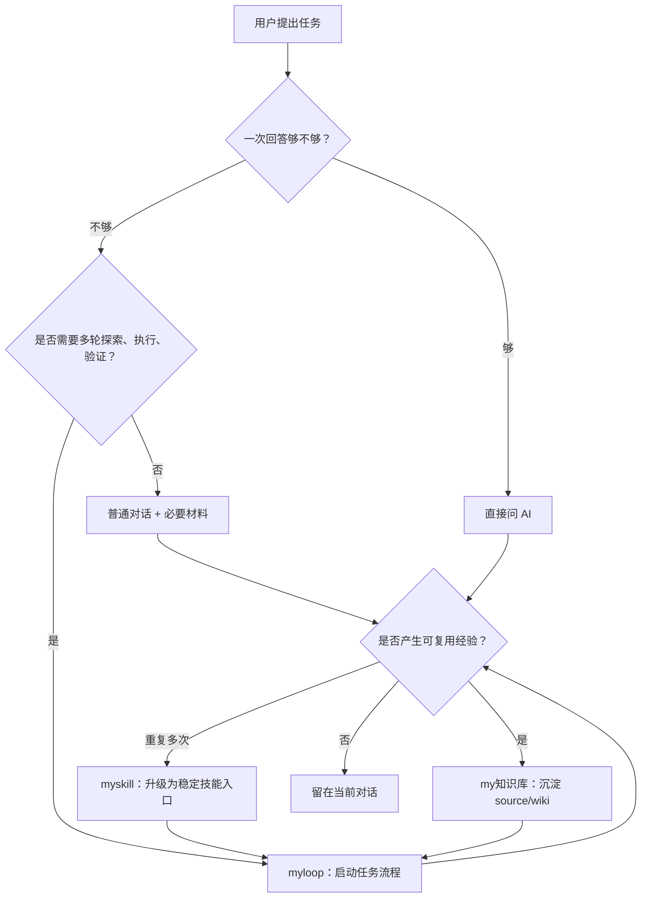
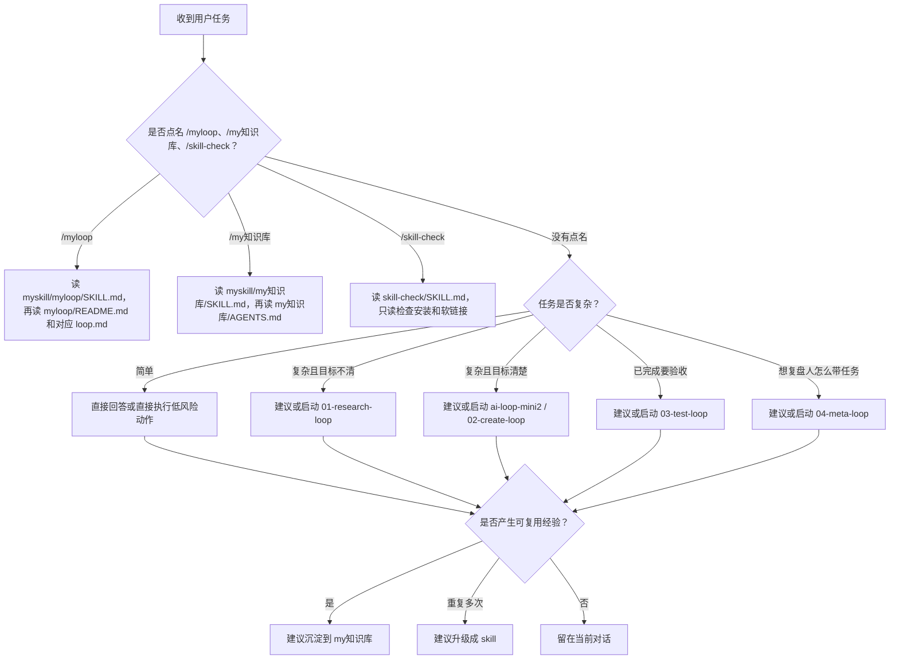

# 个人 AI 自动化系统使用说明

> 给其他 Agent（智能体）看的总入口。读完这份文档后，应能正确使用 `/Users/ycl/Desktop/myskill`、`/Users/ycl/Desktop/myloop`、`/Users/ycl/Desktop/my知识库`，并知道什么时候直接问答、什么时候启动 Loop（循环）、什么时候沉淀经验。

## 0. 一句话总览

这套系统不是一个单独工具，而是一个个人 AI 操作系统：

```text
myskill = 技能入口层，负责“怎么启动”
myloop = 复杂任务流程层，负责“怎么推进”
my知识库 = 经验沉淀层，负责“怎么复用”
```

核心思想：

```text
skill（技能）
-> loop（循环）
-> md/wiki（Markdown 文档 / 维基）
-> memory（记忆）
-> better AI use（更会用 AI）
-> faster learning（学得更快）
```

白话说：简单问题直接问 AI；复杂任务用 loop 带着 AI 深挖；有复用价值的经验写进知识库；重复多次的流程再升级成 skill。这样每次使用 AI 都会给下一次使用 AI 增加一点“复利”。

## 1. 目录地图

| 层 | 路径 | 角色 | 不该做什么 |
| --- | --- | --- | --- |
| skill（技能）入口层 | `/Users/ycl/Desktop/myskill` | 给 Codex、Claude Code 等 Agent 一个稳定入口 | 不要把完整流程都复制进 skill |
| loop（循环）流程层 | `/Users/ycl/Desktop/myloop` | 复杂任务、多轮探索、执行、测试、复盘 | 不要直接污染母模板承载真实任务 |
| LLM Wiki（大语言模型维基）经验层 | `/Users/ycl/Desktop/my知识库` | 保存 source（原始证据）和 wiki（提炼答案） | 不要把它当流水账或敏感信息仓库 |

三个目录的关系：



## 2. myskill：技能入口层

### 2.1 定位

`myskill` 是“遥控器”，不是“发动机”。

它的职责是让不同 Agent 知道：

- 用户说 `/myloop` 时，应该去读 `/Users/ycl/Desktop/myloop`。
- 用户说 `/my知识库` 时，应该去读 `/Users/ycl/Desktop/my知识库/AGENTS.md`。
- 用户说 `/skill-check` 时，应该只读检查 skill 安装状态。
- 用户说控制如流机器人、如流群测试等时，才进入对应专项 skill。

不要把真实流程复制进 `SKILL.md`。真实流程应该继续放在 `myloop` 或 `my知识库` 里面。

### 2.2 当前主要 skill

| Skill | 路径 | 触发场景 | 真实来源 |
| --- | --- | --- | --- |
| `myloop` | `/Users/ycl/Desktop/myskill/myloop/SKILL.md` | 用户说 `/myloop`、`myloop`、启动深度循环 | `/Users/ycl/Desktop/myloop` |
| `my知识库` | `/Users/ycl/Desktop/myskill/my知识库/SKILL.md` | 用户说 `/my知识库`、沉淀经验、更新本地知识库 | `/Users/ycl/Desktop/my知识库/AGENTS.md` |
| `skill-check` | `/Users/ycl/Desktop/myskill/skill-check/SKILL.md` | 检查 Claude Code skill 安装、软链接、触发准备状态 | `/Users/ycl/Desktop/myskill/Claude-Code配置说明.md` |
| `控制如流机器人` | `/Users/ycl/Desktop/myskill/控制如流机器人/SKILL.md` | 操作如流桌面端、真实 @ 机器人、验证 bridge/Webhook 链路 | 该 skill 内的专项流程 |

### 2.3 Agent 使用规则

当你作为 Agent 看到用户提到 `myskill`：

1. 先读 `/Users/ycl/Desktop/myskill/Claude-Code配置说明.md`，理解安装和软链接规则。
2. 再读目标 skill 的 `SKILL.md`。
3. 判断这是“入口问题”还是“真实流程问题”。
4. 如果只是安装、软链接、触发排查，优先用 `skill-check` 思路，只读检查。
5. 如果要改真实流程，不要优先改 `myskill`，而要去改对应真实来源：
   - Loop 流程改 `/Users/ycl/Desktop/myloop`。
   - 知识库写入规则改 `/Users/ycl/Desktop/my知识库/AGENTS.md`。

### 2.4 边界

必须先问用户再做：

- 新建、删除、移动 skill 目录。
- 修改 `~/.claude/skills` 或 `~/.codex/skills` 软链接。
- 修改 `SKILL.md`、`agents/openai.yaml`。
- 增加新别名、新安装位置。
- 把一个 wiki 经验升级成 skill。

### 2.5 设计建议

好 skill 应该短、稳、像路标。

适合升级成 skill 的经验：

- 重复很多次。
- 输入、步骤、输出比较固定。
- 单靠 wiki 看说明太慢。
- 需要 Agent 自动按流程执行。

不适合升级成 skill 的经验：

- 还没验证过的想法。
- 一次性的任务细节。
- 需要大量业务判断的复杂流程。
- 已经由 `myloop` 或 wiki 清楚承载的内容。

## 3. myloop：复杂任务流程层

### 3.1 定位

`myloop` 是复杂任务的工作流系统。它不是让 AI 完全替代人，而是把“会用 AI 的人”的标准动作文件化：

- 先理解目标。
- 收集上下文。
- 明确 Done（完成）标准。
- 深入探索或执行。
- 做测试/评价。
- 记录证据和风险。
- 需要判断时返回给人。
- 有价值的结果再沉淀到知识库。

白话说：loop 像一个“有检查表的高级用 AI 方法论”。它帮人少忘步骤、少丢上下文、少漏验证，但不代替人做高风险判断。

### 3.2 总入口

必须优先读：

```text
/Users/ycl/Desktop/myloop/README.md
/Users/ycl/Desktop/myloop/task-initializer.md
```

默认执行模板：

```text
/Users/ycl/Desktop/myloop/ai-loop-mini2/loop.md
```

不要为了升级流程去改 `/Users/ycl/Desktop/myskill/myloop/SKILL.md`。skill 只是入口，流程真实来源是 `/Users/ycl/Desktop/myloop`。

### 3.3 三个执行模板

| 模板 | 定位 | 适合场景 |
| --- | --- | --- |
| `ai-loop-mini` | 轻脚手架、信任优先、Markdown 驱动 | 想让 AI 自主探索、记录、评价和优化 |
| `ai-loop-mini2` | human-guided deep loop（人引导的深度循环） | 默认推荐；少交互、长思考、最多三轮、复杂问题问人 |
| `ai-loop-mini3` | while-driven deep loop（while 脚本驱动的深度循环） | 实验性；多终端 Claude/Codex 文件交互、脚本控轮次 |

默认选 `ai-loop-mini2`，除非用户明确需要脚本控轮次、多终端交互、文件锁和 `status:` 字段。

### 3.4 五个场景 Loop

| 场景 Loop | 定位 | 适合场景 |
| --- | --- | --- |
| `01-research-loop` | 查找/需求 Loop | 目标不清楚，先查资料，输出需求和 Done 标准 |
| `02-create-loop` | 创建/实现 Loop | 目标清楚后，创建项目、改代码、写文档 |
| `03-test-loop` | 测试/验收 Loop | 独立测试，不默认相信实现者，给验收结论 |
| `04-meta-loop` | 元学习 Loop | 回看一次完整任务，学习“人是怎么带任务的” |
| `codexclaude配合loop` | 双 Agent 开发协作 Loop | Codex 做总控，Claude Code 做项目内开发、自检和 Git 交接 |

推荐顺序：

```text
01-research-loop 查清楚
02-create-loop 做出来
03-test-loop 验明白
04-meta-loop 学人怎么带任务
```

如果用户只是说“做一个复杂任务”，但没有说阶段，先按这个顺序判断：

- 目标不清楚：读 `01-research-loop/loop.md`。
- 目标清楚、要实现：读 `02-create-loop/loop.md`。
- 已完成、要验收：读 `03-test-loop/loop.md`。
- 想复盘人的任务处理方式：读 `04-meta-loop/loop.md`。
- 明确要 Codex + Claude Code 配合：读 `codexclaude配合loop/loop.md`。

### 3.5 任务特化流程

真实任务不建议直接写进母模板。应该在目标项目里创建任务专用 Loop：

```text
目标项目/
  .project-loops/
    任务名/
      00-alignment/
        initial-understanding.md
        user-confirmation.md
        final-alignment.md
      01-state/
      02-context-pack/
      03-history/
      04-reflection/
      05-evaluation/
      08-outputs/
      修改记录.md
      loop.md
      README.md
```

初始化步骤：

1. 读目标项目结构、README、AGENTS、CLAUDE、docs、测试、脚本、配置、最近 git 状态。
2. 尝试读取当前可访问的会话、记忆、历史摘要，但不要假装有稳定接口。
3. 写 `00-alignment/initial-understanding.md`。
4. 给用户摘要，请用户补充目标、限制、验证方式、输出格式。
5. 写 `00-alignment/user-confirmation.md`。
6. 特化任务 Loop 文件。
7. 初始化任务 Loop 自己的本地 git：

```bash
git init
git add .
git commit -m "Initial task loop"
```

8. 写 `00-alignment/final-alignment.md`，再问用户是否开始第 1 轮。

注意：这个 git 只管理任务 Loop 自己的文件，不替目标项目提交代码、推送或回滚。

### 3.6 每轮 Loop 的基本输出

每轮结束至少给用户：

```text
本轮结论：
证据：
质的提升：
风险：
需要人判断的问题：
建议下一步：
```

### 3.7 边界

必须先问用户再做：

- 修改母模板本身。
- 删除、覆盖、重命名重要文件。
- 安装依赖。
- 部署、发布、提交、推送。
- 访问账号、密钥、token（令牌）或真实外部系统。
- 多条路线都可行但涉及业务取舍。
- 继续推进需要高风险判断。

## 4. my知识库：经验沉淀层

### 4.1 定位

`my知识库` 是本地私有 LLM Wiki（大语言模型维基）。它的目标不是记录所有聊天，而是把可复用经验沉淀成：

- 可追溯的 source（原始证据）。
- 可阅读的 wiki（提炼答案）。
- 可导航的入口页。
- 可维护的日志和索引。

白话说：`sources/` 放证据，`wiki/` 放答案，`导航/` 放路牌，`维护/` 放后台台账。

### 4.2 必读入口

当用户说 `/my知识库`、沉淀经验、更新本地知识库时，必须先读：

```text
/Users/ycl/Desktop/my知识库/AGENTS.md
```

然后按顺序读：

```text
/Users/ycl/Desktop/my知识库/index.md
/Users/ycl/Desktop/my知识库/维护/当前上下文交接.md
/Users/ycl/Desktop/my知识库/导航/README.md
/Users/ycl/Desktop/my知识库/wiki/README.md
```

必要时再读：

```text
/Users/ycl/Desktop/my知识库/维护/全量索引.md
/Users/ycl/Desktop/my知识库/wiki/<category>/index.md
/Users/ycl/Desktop/my知识库/sources/<category>/<topic>/source.md
```

不要一上来全文扫描所有资料。先通过 `index.md` 和 `导航/` 定位，再读最相关的内容。

### 4.3 目录职责

| 目录 | 职责 |
| --- | --- |
| `sources/` | 原始经验、截图、脚本、命令输出、失败记录，尽量保留原貌 |
| `wiki/` | 提炼后的结论、流程、排查清单和可复用说明 |
| `导航/` | 给人和 Agent 的前台地图，只放入口和简短说明 |
| `templates/` | 新增 source、wiki、分类索引、故障排查页时使用 |
| `inbox/` | 临时资料入口，整理后应归档 |
| `维护/` | 全量索引、当前交接、log、roadmap、设计说明 |
| `index.md` | 轻量总入口 |
| `AGENTS.md` | Agent 维护硬规则 |

### 4.4 当前固定分类

| 分类 | 适合内容 |
| --- | --- |
| `codex` | Codex Desktop、Codex CLI、Codex 连接服务、浏览器读取、个人 AI 操作系统 |
| `claude-code` | Claude Code、Claude Agent、Claude 远程操作经验 |
| `daily` | Mac、终端、快捷键、文件路径等日常经验 |
| `vm` | 虚拟机、SSH、远程机器、隧道、连接工具 |
| `troubleshooting` | 跨分类故障排查、排错清单、常见问题 |

如果一个经验同时属于多个分类，优先放到最稳定的基础分类。例如虚拟机连接同时服务 Codex 和 Claude，优先放 `vm`。

### 4.5 写入流程

新增资料：

1. 判断是否属于已有主题。
2. 临时资料先放 `inbox/`。
3. 在 `sources/<category>/<topic>/` 下创建或更新原始资料。
4. 原始 Markdown 用 `source.md`。
5. 根据 `templates/source-template.md` 补元数据。
6. 新建或更新对应 `wiki/<category>/<页面名>.md`。
7. 更新根 `index.md`、必要时更新 `维护/全量索引.md` 和分类 `index.md`。
8. 如果影响查找路径，更新对应 `导航/*.md`。
9. 在 `维护/log.md` 记录本次维护。

更新已有资料：

- 原始事实、截图、脚本、命令输出：放 `sources/`。
- 提炼后的结论、流程、排查清单：放 `wiki/`。
- 旧 wiki 和 source 冲突：以 source 为事实依据，更新 wiki，并在 `维护/log.md` 记录。
- 不确定的新规则：先写 `维护/roadmap.md`，不要直接改 `AGENTS.md`。

### 4.6 敏感信息规则

知识库虽然是本地私有，但仍要控制敏感信息扩散。

不要在 wiki 里复述完整：

- token（令牌）
- key（密钥）
- 密码
- 私钥
- 完整内网地址
- 账号标识
- SSH 机密

如果必须保留具体敏感值，优先放 source，并把页面 `sensitivity` 标为 `sensitive`。对外分享前必须脱敏。

### 4.7 什么时候沉淀到知识库

适合沉淀：

- 下次还会用的命令、路径、排查流程。
- 已经验证过的工具链经验。
- 某项目的关键设计结论。
- 复杂任务的复盘。
- 让下次 Agent 少走弯路的规则。

不适合沉淀：

- 没有复用价值的聊天流水。
- 用户还没确认的猜想。
- 过度敏感的信息。
- 只对当前任务临时有效的细节。

## 5. 推荐路由规则

Agent 处理用户任务时，按这个顺序判断：



## 6. 给其他 Agent 的最短操作手册

### 6.1 用户说“启动 myloop”

执行：

1. 读 `/Users/ycl/Desktop/myskill/myloop/SKILL.md`。
2. 读 `/Users/ycl/Desktop/myloop/README.md`。
3. 根据任务阶段选择场景 Loop 或默认 `ai-loop-mini2`。
4. 如果是真实任务，读 `/Users/ycl/Desktop/myloop/task-initializer.md`。
5. 先做 `initial-understanding.md`，和用户对齐，不要直接开跑。
6. 高风险动作先问人。

### 6.2 用户说“沉淀到 my知识库”

执行：

1. 读 `/Users/ycl/Desktop/myskill/my知识库/SKILL.md`。
2. 读 `/Users/ycl/Desktop/my知识库/AGENTS.md`。
3. 读 `index.md` 和相关导航页。
4. 判断是更新已有主题还是新建主题。
5. source 放证据，wiki 放结论。
6. 更新索引、导航和 `维护/log.md`。
7. 最后报告改了哪些文件。

### 6.3 用户说“检查 skill”

执行：

1. 读 `/Users/ycl/Desktop/myskill/skill-check/SKILL.md`。
2. 读 `/Users/ycl/Desktop/myskill/Claude-Code配置说明.md`。
3. 检查 `/Users/ycl/Desktop/myskill` 源目录。
4. 检查 `~/.claude/skills` 软链接。
5. 检查 `SKILL.md` 和 `agents/openai.yaml`。
6. 输出 pass/fail（通过/失败）矩阵。
7. 默认只读，不自动修。

### 6.4 用户只是说“总结/优化我的系统”

执行：

1. 先读 `/Users/ycl/Desktop/my知识库/wiki/codex/个人AI操作系统.md`。
2. 再读 `/Users/ycl/Desktop/myloop/README.md`。
3. 再读 `/Users/ycl/Desktop/myskill/Claude-Code配置说明.md`。
4. 输出时按三层分工组织：
   - skill（技能）：入口和自动触发。
   - loop（循环）：复杂任务流程。
   - md/wiki（文档/维基）：经验沉淀。
5. 每条建议说明：
   - 建议内容。
   - 为什么。
   - 建议放哪里。
   - 风险。
   - 是否需要等用户确认。

## 7. 思想总结

### 7.1 这套系统真正解决什么

普通 AI 使用是一次性的：

```text
人提问 -> AI 回答 -> 结束
```

这套系统想变成复利型：

```text
人提问
-> AI 解决
-> loop 记录过程
-> 知识库沉淀经验
-> skill 固化重复流程
-> 下次 AI 更快理解你
-> 人学得更快
```

### 7.2 loop 的哲学

loop 不是“让 AI 自己无限跑”。它更像一个会用 AI 的人留下的操作手册：

- 先看目标。
- 再补上下文。
- 再做判断。
- 再验证。
- 再记录。
- 复杂处问人。

它的价值不是替代人，而是让人不用每次都重新提醒 AI：“你要先读文件、要写证据、要检查风险、要问我确认”。

### 7.3 skill 的哲学

skill 是把重复经验变成稳定入口。

但 skill 不应该膨胀。它最适合做：

- 路由。
- 启动。
- 最小边界。
- 读取真实流程。

如果一个 skill 越写越长，通常说明它在复制 wiki 或 loop 的工作，应该拆回真实流程层。

### 7.4 知识库的哲学

知识库不是收藏夹，也不是日记。

它应该回答一个问题：

```text
下次我或 Agent 遇到类似问题，能不能少解释、少试错、更快到正确路径？
```

能，就沉淀。不能，就留在当前对话。

### 7.5 自动化的节奏

不要一上来追求全自动。更稳的路线是：

1. 先用 Markdown 把流程说清楚。
2. 再用 loop 让 AI 按流程跑。
3. 再用 wiki 记录重复经验。
4. 再把稳定流程升级成 skill。
5. 最后才考虑脚本、定时任务、多 Agent、外部插件。

自动化不是越多越好。好的自动化应该让人更清楚、更省心，而不是制造新的黑箱。

## 8. 给后续建设的建议

### 8.1 建议一：建立“今日沉淀判断”

每天只问一个问题：

```text
今天有没有一条经验，下次复用能省 10 分钟以上？
```

有就沉淀到 `my知识库`；没有就不写。

### 8.2 建议二：每周做一次三桶复盘

每周把经验分三桶：

| 桶 | 判断问题 | 放哪里 |
| --- | --- | --- |
| skill | 是否重复、固定、可执行？ | `/Users/ycl/Desktop/myskill` |
| loop | 是否复杂、多轮、要验证？ | `/Users/ycl/Desktop/myloop` |
| md/wiki | 是否可复用但不一定自动执行？ | `/Users/ycl/Desktop/my知识库` |

### 8.3 建议三：把“人怎么带任务”交给 meta-loop

当一次任务完成得很好，不要只记录结果。还要问：

```text
这次人是怎么判断、追问、纠偏、验收的？
```

这类经验适合进入 `04-meta-loop`，它能把人的任务处理方式提炼成下次 AI 可复用的流程。

### 8.4 建议四：保持 skill 短，保持 wiki 清楚，保持 loop 可执行

一个健康状态是：

- skill 很短：知道去哪里读。
- wiki 清楚：知道结论和证据。
- loop 可执行：知道每轮要干什么、写什么、何时停。

如果三者边界混乱，优先按这个原则重构：

```text
入口归 skill
过程归 loop
结论归 wiki
证据归 source
规则归 AGENTS/CLAUDE
```

## 9. 其他 Agent 必须遵守的硬边界

1. 尽量用中文回答；英文专有名词后加中文解释。
2. 每次回答最后加“白话总结”。
3. 不要假装读过不可访问的会话、文件或知识库。
4. 涉及本机可验证的问题，优先直接检查本地状态。
5. 不要默认删除、覆盖、部署、提交、推送。
6. 不要把敏感信息完整写进 wiki。
7. 不要把真实流程复制进 skill。
8. 不要直接修改 myloop 母模板，除非用户明确要求。
9. 不要把所有经验都写进知识库，只写可复用经验。
10. 如果多个分类都合理，先问用户，或者选择最稳定的基础分类并说明原因。

## 10. 快速检查清单

开始前：

- [ ] 我是否读了对应入口文件？
- [ ] 我是否判断了这是 skill、loop 还是知识库任务？
- [ ] 我是否知道真实 source of truth（真实来源）在哪里？
- [ ] 我是否避免全文乱扫？

执行中：

- [ ] 我是否留下证据、风险、下一步？
- [ ] 我是否在高风险动作前问人？
- [ ] 我是否把 source 和 wiki 分开？
- [ ] 我是否更新了必要索引和 log？

结束前：

- [ ] 我是否报告了改动文件？
- [ ] 我是否说明哪些没做？
- [ ] 我是否给出白话总结？
- [ ] 我是否提出下一步建议，但不强行继续？

## 白话总结

这套系统可以理解成：`myskill` 是遥控器，`myloop` 是复杂任务的跑法，`my知识库` 是经验仓库。Agent 不要把三者混在一起。启动看 skill，干复杂活看 loop，沉淀经验看知识库；能复用才写，风险动作先问人，所有规则都尽量文件化但不要过度自动化。
