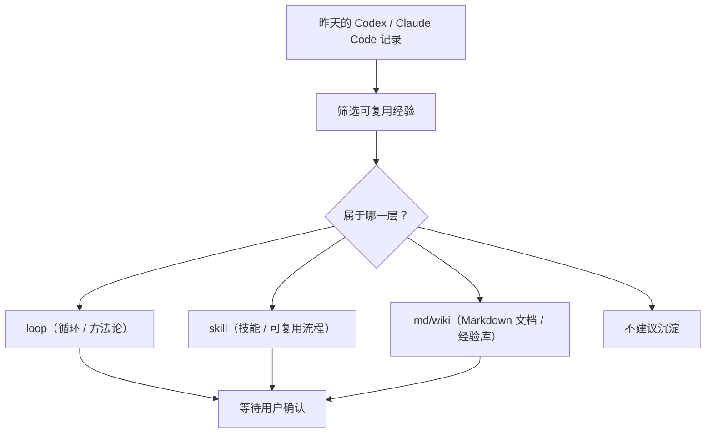

# 全盘优化晨报自动化设计

## 适用场景

当需要每天自动复盘前一天 Codex（代码智能体）和 Claude Code（代码智能体）的使用记录，并判断哪些内容值得沉淀到个人 AI 操作系统时，先读这页。

这页解决的问题：

- `全盘优化` 自动化每天应该看什么。
- 输出为什么要像“晨报”，而不是技术审计报告。
- 怎么把建议分成 `loop`、`skill`、`md/wiki` 三层。
- 为什么默认只给建议，不自动修改文件。
- 以后要怎么继续优化这个自动化。

## 快速结论

`全盘优化` 是一个每天 9:15 运行的只读审查自动化。它的目标不是直接改文件，而是每天早上给一份容易读的“AI 操作系统晨报”：

```text
昨天发生了什么
-> 哪些痛点可以优化
-> 哪些经验应该进 loop / skill / md
-> 今天用 15 分钟做一个小动作
-> 等用户确认后再改文件
```

三层判断是核心：

| 层 | 白话理解 | 对应位置 | 适合放什么 |
| --- | --- | --- | --- |
| `loop（循环 / 方法论）` | 以后遇到复杂任务时，AI 应该怎么一步步推进 | `$HOME/Desktop/myloop` | 复杂任务流程、检查、复盘、边界、收口规则 |
| `skill（技能 / 可复用流程）` | 以后一句话就能叫出来的固定技能入口 | `$HOME/Desktop/myskill` | 稳定触发词、可复用流程、固定启动入口 |
| `md/wiki（Markdown 文档 / 经验库）` | 这次学到的经验，下次不要再从零解释 | `$HOME/Desktop/my知识库` | 经验、排查清单、方法总结、工具使用结论 |

## 标准流程

### 1. 每天审查前一天

自动化每天早上运行，审查前一个自然日。

优先检查：

- Codex 会话：`$HOME/.codex/sessions`
- Codex 记忆：`$HOME/.codex/memories`
- Claude Code 记录：`$HOME/.claude`
- 知识库：`$HOME/Desktop/my知识库`
- Loop 模板：`$HOME/Desktop/myloop`
- Skill 入口：`$HOME/Desktop/myskill`

如果某些路径读不到，必须明确说读不到，不要假装读过。

### 2. 输出要像晨报

旧版输出像审计报告，问题是路径太多、文字太密、早上不容易读。

新版输出要求：

- 先给一句话结论。
- 用 Mermaid（流程图）画总图。
- 用白话讲昨天真正的痛点。
- 把建议分成 `loop`、`skill`、`md/wiki` 三块。
- 每条建议都要写清：建议内容、为什么、放哪里、风险、是否等用户确认。
- 少列绝对路径，只在必要时给目标文件夹或页面。

推荐结构：

```text
# 全盘优化晨报

## 一句话结论
## 今日总图
## 昨天真正的痛点
## 1. loop（循环 / 方法论）建议
## 2. skill（技能 / 可复用流程）建议
## 3. md/wiki（Markdown 文档 / 经验库）建议
## 不建议沉淀的东西
## 今日 AI 灵感
## 今日 15 分钟行动
## 需要你确认
## 白话总结
```

### 3. 总图模板



### 4. 今日 15 分钟行动要结合真实痛点

不要写泛泛的飞轮口号，例如“今天选一个问题、问 AI、沉淀经验”。这类话太空。

更好的写法是：

```text
昨天痛点：反复手动查会话里是否有可沉淀经验。
今天 15 分钟行动：让 AI 只挑 1 条最适合进知识库的经验，并说明为什么不选其他内容。
```

每日行动要结合：

- 昨天真实卡点。
- 哪些工作本来可以自动化。
- 哪些步骤可以做成模板。
- 哪些经验可以进知识库。
- 当日 AI 技术、工具、报告里对个人 AI 操作系统有启发的点。

## 常见问题

| 问题 | 判断方式 | 处理办法 |
| --- | --- | --- |
| 为什么不让自动化直接改文件？ | 涉及知识库、Loop、Skill 这些长期资产 | 先给建议，用户确认后再改 |
| 为什么要分三层？ | 不同经验应该进入不同系统位置 | 方法论进 `myloop`，技能入口进 `myskill`，经验总结进 `my知识库` |
| 为什么要少列路径？ | 用户每天早上读，不是做代码审计 | 只列关键文件夹和目标页面 |
| 为什么要加 Mermaid 图？ | 图能让用户一眼看懂判断流程 | 每次晨报至少一张总图 |
| 能不能固定在同一个线程里？ | 当前 cron 自动化直接绑定指定线程未成功 | 后续可尝试 heartbeat（线程唤醒）版本 |

## 排查清单

- [ ] 晨报是否先给一句话结论？
- [ ] 是否有 Mermaid（流程图）？
- [ ] 是否分成 `loop`、`skill`、`md/wiki` 三层？
- [ ] 每层是否先用白话解释这一层是什么？
- [ ] 每条建议是否写清“为什么、放哪里、风险、是否等确认”？
- [ ] 是否避免直接修改 `my知识库`、`myloop`、`myskill`？
- [ ] 今日 15 分钟行动是否结合真实痛点，而不是泛泛口号？

## 相关来源

- `$HOME/.codex/automations/automation/automation.toml`
- `wiki/codex/个人AI操作系统.md`
- `$HOME/Desktop/myloop`
- `$HOME/Desktop/myskill`
- `$HOME/Desktop/my知识库`

## 后续可改进

- 试一个 heartbeat（线程唤醒）版本，看是否能稳定固定到指定线程。
- 等晨报连续跑几天后，观察哪些建议经常重复，再升级成 `myloop` 或 `myskill` 规则。
- 可以加入“晨报评分”：是否白话、是否有图、是否三层清楚、是否有可执行 15 分钟动作。
- 如果每日 AI 灵感质量不稳定，可以限制来源或改成“本地经验优先，联网灵感可选”。

## 白话总结

`全盘优化` 不是让 AI 每天自动乱改文件，而是每天早上帮用户看一眼：昨天有什么经验值得留下，应该放进 `myloop`、`myskill`，还是 `my知识库`。输出要像晨报，先讲人话、画图、分三层给建议，最后等用户确认再动手。
