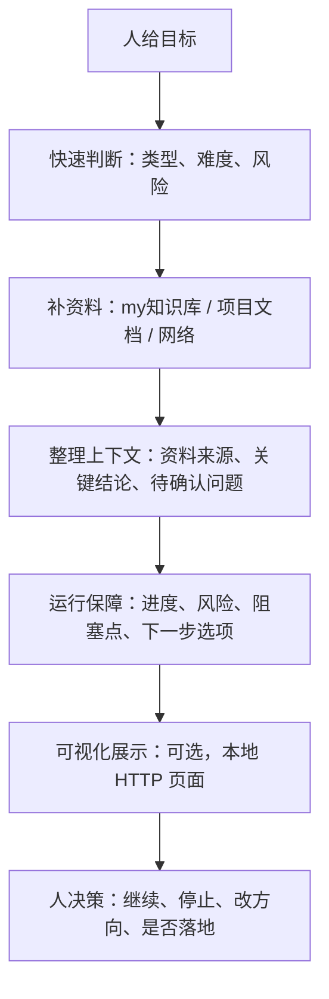

# 简单 loop

这是一个最小辅助型 Loop（循环）说明。它给其他任务读取后自行配置使用，不要求先复制完整模板，也不默认新建复杂目录。

核心原则：

- 如无必要，无增实体。
- AI 只做补资料、整理上下文、运行保障和展示。
- 决策全部由人完成。
- 优先关注 `myskill`、`myloop`、`my知识库` 三层体系。
- 先查 `my知识库`，再查目标项目资料，再按需要查网络或官方文档。
- 平时优先用苏格拉底式对话把需求问清楚，不急着生成文件或网页。
- 不默认写入文件、不默认沉淀经验、不默认安装依赖、不默认启动长期服务。

## 适用场景

适合这些任务：

- 目标还不复杂，但需要 AI 帮忙补资料。
- 人想自己决策，只让 AI 整理信息和提醒风险。
- 需要把多个资料源整理成一个上下文包。
- 需要一个简单的运行状态展示，例如本地 HTTP（超文本传输协议）页面。
- 想让其他项目快速套用一个轻量 Loop（循环），但不想复制完整 `ai-loop-mini2`。

不适合这些任务：

- 需要 AI 自动替人做长期决策。
- 需要复杂多 Agent（多智能体）协作。
- 需要自动部署、发布、提交或修改线上系统。
- 需要严格测试验收；这类任务优先看 `03-test-loop`。
- 需要 Codex 和 Claude Code 配合开发；这类任务优先看 `codexclaude配合loop`。

## 最小流程



## 分层思考方式

这个 Loop（循环）借用三层思考，但把最终决策交给人。

| 层级 | AI 做什么 | 输出什么 | 谁决策 |
| --- | --- | --- | --- |
| 快速判断层 | 判断任务类型、难度、风险、是否需要查资料 | 初步方向和风险提示 | 人 |
| 资料整理层 | 查 `my知识库`、项目文档、历史记录、必要时联网 | 上下文包、资料来源、问题清单 | 人 |
| 运行保障层 | 展示进度、阻塞、风险、下一步选项 | 状态面板或文字报告 | 人 |

## 每次运行必须先做

1. 确认目标：用户要解决什么问题。
2. 确认边界：哪些能做，哪些不能做。
3. 确认输出：用户要报告、文件、网页展示，还是只要建议。
4. 查本地规则：
   - `/Users/ycl/Desktop/myskill`
   - `/Users/ycl/Desktop/myloop`
   - `/Users/ycl/Desktop/my知识库`
5. 先查 `my知识库` 中是否已有类似经验。

## 推荐读取顺序

```text
1. 用户当前指令
2. 目标项目 README.md / AGENTS.md / CLAUDE.md / docs
3. /Users/ycl/Desktop/my知识库
4. /Users/ycl/Desktop/myloop 中相关 loop
5. 官方文档或网络资料
```

如果资料过多，先列目录和命中摘要，不要一次性吞大量正文。

## 输出格式

每轮输出尽量固定成这个结构：

```text
当前目标：
我已查资料：
关键结论：
待你决策：
风险和边界：
下一步选项：
白话总结：
```

其中“待你决策”必须明确列出来，不要藏在长段落里。

## 运行状态记录

如果只是口头任务，可以不建任何文件。

如果需要跨轮继续，最多建议记录这几个轻量文件：

```text
context.md      # 当前上下文包
sources.md      # 查过的资料来源
questions.md    # 等人决策的问题
state.json      # 可选，给展示页面读取的状态
```

只有在用户明确要求时，才创建这些文件。

## 可视化展示

可视化展示只做运行保障，不做复杂平台。

平时不默认生成 HTTP（超文本传输协议）页面。只有在已经查完一轮资料、进入总结和确认阶段，并且资料来源、风险或待确认点比较多时，AI 才应该问人：

```text
现在资料和待确认点已经比较多了，要不要生成一个本地 HTTP 总结看板？
```

人确认后再生成；人没确认，就只在对话里总结。

最小展示内容：

- 当前目标。
- 当前阶段。
- 已查资料。
- 待人决策。
- 风险和阻塞点。
- 下一步选项。

推荐先用本地 HTTP（超文本传输协议）页面读取 `state.json` 或 Markdown（文档）文件展示。

不建议一开始引入：

- 数据库。
- 登录系统。
- 复杂前端框架。
- 自动调度系统。
- 长期后台服务。

## AI 行为边界

AI 可以自己做：

- 读文件。
- 搜索资料。
- 总结资料。
- 对比资料。
- 提醒风险。
- 生成候选方案。
- 生成临时展示页面草案。

AI 必须问人：

- 是否修改文件。
- 是否写入 `my知识库`。
- 是否创建新目录或新服务。
- 是否安装依赖。
- 是否提交 Git（版本控制）。
- 是否启动长期服务或定时任务。
- 遇到业务判断、路线取舍、风险较高的操作。

AI 不应该做：

- 代替人做最终决策。
- 为了显得完整而增加实体。
- 自动把普通过程沉淀进知识库。
- 把临时展示做成复杂平台。
- 跳过 `my知识库` 直接联网。

## 和现有 loop 的关系

| 已有 Loop | 和简单 loop 的关系 |
| --- | --- |
| `ai-loop-mini2` | 默认复杂任务底座；简单 loop 可作为它的轻量模式 |
| `01-research-loop` | 如果目标不清楚，简单 loop 可以先借它的查资料思路 |
| `02-create-loop` | 如果确认要创建或实现，再切到它 |
| `03-test-loop` | 如果要独立验收，再切到它 |
| `04-meta-loop` | 如果要复盘人的处理方式，再切到它 |
| `codexclaude配合loop` | 如果要双 Agent（双智能体）开发协作，再切到它 |

## 其他任务如何调用

其他任务可以这样引用：

```text
请读取 /Users/ycl/Desktop/myloop/简单loop.md，
按“简单 loop”的方式帮我做：
1. 先查 my知识库 和目标项目资料；
2. 只整理资料、风险、问题和下一步选项；
3. 不替我做决策；
4. 不默认改文件；
5. 如果需要可视化展示，先给最小 HTTP 展示方案，等我确认再落地。
```

## Done 标准

一次简单 loop 跑完，至少要让人看到：

- 查了哪些资料。
- 当前最重要的结论是什么。
- 还有哪些不确定。
- 需要人做哪些决策。
- 下一步可以选什么。
- 有没有值得沉淀到 `my知识库` 的经验候选。

## 白话总结

简单 loop 就是让 AI 当“资料员 + 整理员 + 运行看板”，不是让 AI 当老板。AI 先查 `my知识库`，再查项目和网络，把资料、风险、问题和下一步选项摆清楚；是否继续、怎么取舍、要不要落地，全部由人决定。
