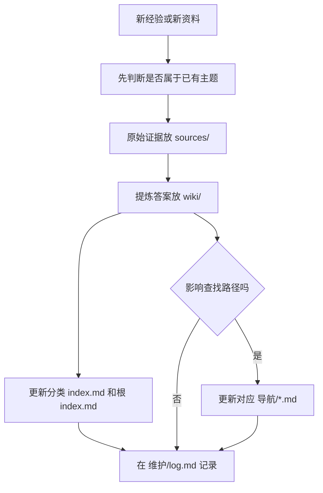

# 我的知识库

这是一个本地私有 LLM Wiki（大语言模型维基）模板。根目录只保留少量入口，详细台账、日志和设计说明都放到 `维护/`。

## 先看哪里

| 入口 | 给谁看 | 用途 |
| --- | --- | --- |
| `AGENTS.md` | Agent（智能体） | 维护规则、写入流程、敏感信息边界，必须先读 |
| `index.md` | 人 + Agent | 当前这一页，总入口和目录地图 |
| `导航/README.md` | 人 + Agent | 主题导航入口，快速判断该去哪里 |
| `wiki/README.md` | Agent | wiki 页面格式和写作规范 |
| `维护/当前上下文交接.md` | Agent | 当前重点主题、持续追加规则和交接信息 |

## 目录地图

```text
my知识库/
├── AGENTS.md
├── index.md
├── 导航/
├── wiki/
├── sources/
├── templates/
├── inbox/
├── 维护/
└── 说明图片/
```

## 主题导航

| 导航页 | 适合查什么 |
| --- | --- |
| `导航/AI操作系统.md` | 个人 AI 操作系统、skill、loop、wiki 分层 |
| `导航/Loops循环.md` | 复杂任务、长期任务、复盘型 loop（循环）工作流 |
| `导航/Skills技能.md` | skill（技能）入口、已有技能和升级判断 |
| `导航/工具与排障.md` | 工具链、连接、错误排查 |
| `导航/日常环境.md` | Mac、终端、快捷键、截图、文件路径等日常经验 |

## 分类入口

| 分类 | Wiki 入口 | Source 入口 |
| --- | --- | --- |
| Codex | `wiki/codex/index.md` | `sources/codex/` |
| Claude Code | `wiki/claude-code/index.md` | `sources/claude-code/` |
| VM（虚拟机） | `wiki/vm/index.md` | `sources/vm/` |
| Daily（日常） | `wiki/daily/index.md` | `sources/daily/` |
| Troubleshooting（故障排查） | `wiki/troubleshooting/index.md` | 按来源分散在各 source 中 |

## 写入最短流程



## 白话总结

人找资料先看 `index.md` 和 `导航/`；Agent 写资料先看 `AGENTS.md`。`sources/` 放证据，`wiki/` 放答案，`维护/` 放日志、计划和完整台账。
