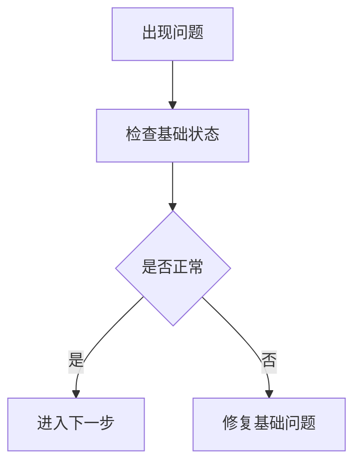

---
title:
category: troubleshooting
type: wiki
updated_at:
source_refs:
  - 
sensitivity:
status: active
---

# 故障排查标题

## 现象

描述用户看到的问题。

## 快速判断

先列最可能的原因和判断命令。

## 排查流程



## 常见原因

| 原因 | 证据 | 处理办法 |
| --- | --- | --- |
|  |  |  |

## 验证命令

```bash
# 填写只读或低风险验证命令
```

## 相关来源

- `sources/...`

## 白话总结

用几句话说明怎么判断和修。
