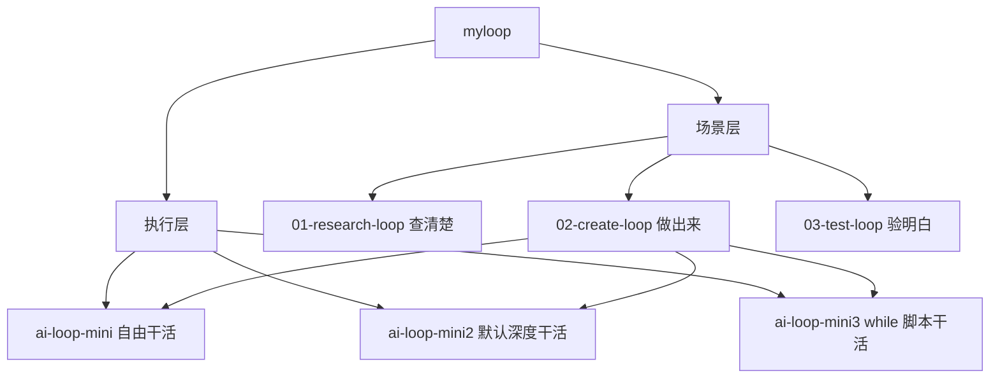
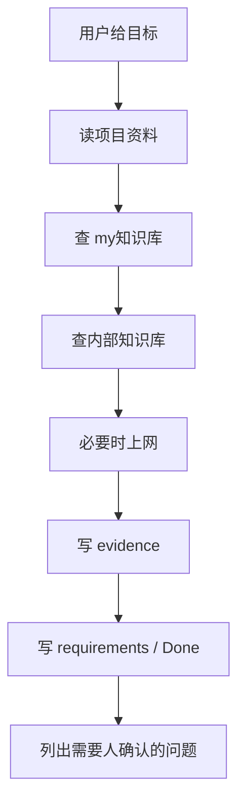
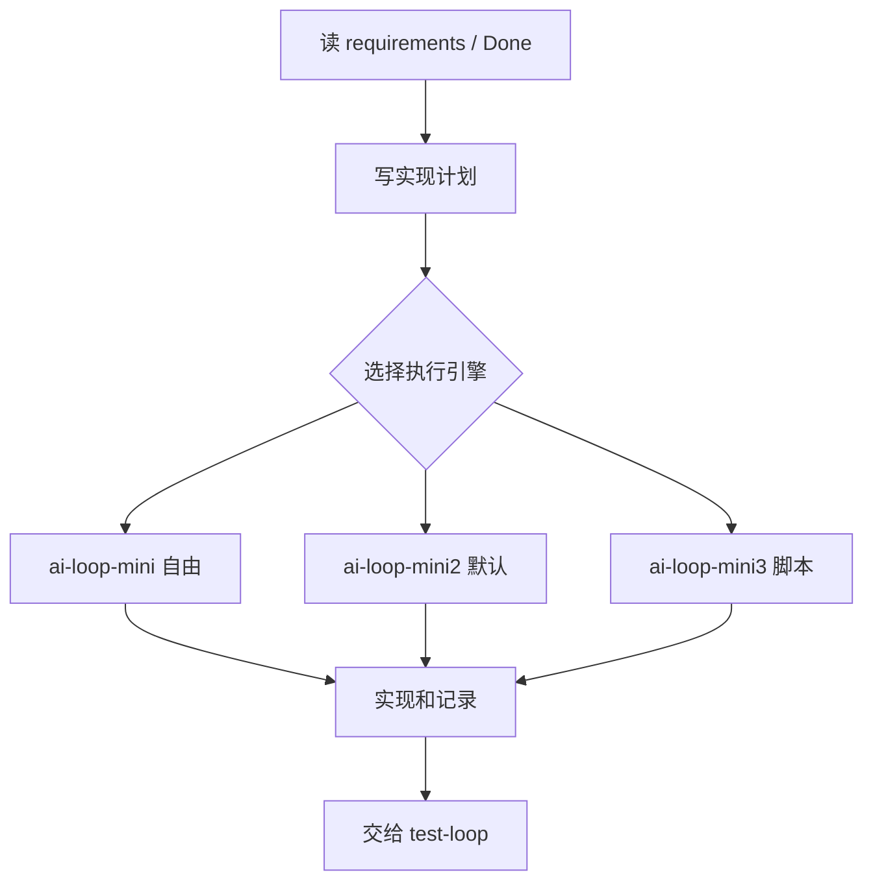
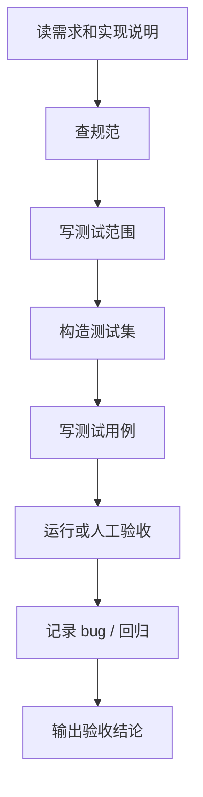

# myloop 场景分层与 Skill 推荐

## 适用场景

适用于使用 `$HOME/Desktop/myloop` 组织 AI Loop（循环）工作流时，判断应该先查需求、直接创建实现，还是独立测试验收。

也适用于给 Codex（代码智能体）或 Claude Code（代码智能体）选择 skill（技能）时，避免一次塞太多工具，而是按场景选择少量可靠能力。

## 快速结论

现在 `myloop` 分成两层：



一句话：

- `01-research-loop`：先查清楚，不急着动手。
- `02-create-loop`：目标清楚后做出来，复用旧 loop1/2/3。
- `03-test-loop`：做完后独立验明白，不默认相信实现者。

旧的 `ai-loop-mini`、`ai-loop-mini2`、`ai-loop-mini3` 没废掉，变成 create（创建/实现）阶段可选的执行引擎。

## 三个场景 Loop

### 01-research-loop：查找/需求 Loop

定位：目标不清楚时，先读项目、查本地知识库、查内部知识库、必要时上网搜索，输出 evidence（证据）、requirements（需求说明）、Done（完成标准）和 open questions（待确认问题）。

推荐流程：



核心文件夹：

| 文件夹 | 用途 |
| --- | --- |
| `00-intake/` | 用户原始问题、目标、限制 |
| `01-local-knowledge/` | 本地项目资料和 `my知识库` 摘要 |
| `02-baidu-ku/` | 内部知识库资料记录 |
| `03-web-research/` | 网络搜索记录 |
| `04-evidence/` | 证据表、来源、可信度 |
| `05-requirements/` | 需求说明、Done 标准 |
| `06-open-questions/` | 需要问人的问题 |
| `07-outputs/` | 最终调研报告 |
| `99-skills/` | 推荐 skill 清单 |

### 02-create-loop：创建/实现 Loop

定位：需求已经清楚后，负责创建项目、改代码、写文档、产出可交付结果。

推荐流程：



核心文件夹：

| 文件夹 | 用途 |
| --- | --- |
| `00-inputs/` | 来自 research Loop 或用户的需求输入 |
| `01-plan/` | 实现计划 |
| `02-worklog/` | 每轮做了什么 |
| `03-outputs/` | 产物和交付说明 |
| `04-handoff-to-test/` | 交给 test Loop 的说明 |
| `engines/` | 指向旧 loop1/2/3 的执行引擎说明 |
| `99-skills/` | 推荐 skill 清单 |

### 03-test-loop：测试/验收 Loop

定位：独立站在 Tester（测试者）角度，构造测试集、写测试用例、运行测试、输出验收结论。

推荐流程：



核心文件夹：

| 文件夹 | 用途 |
| --- | --- |
| `00-test-charter/` | 测试目标、范围、风险 |
| `01-standards/` | 代码规范、测试规范、验收规范 |
| `02-test-data/` | 构造测试集 |
| `03-test-cases/` | 测试用例 Markdown（文档） |
| `04-runs/` | 每次测试运行记录 |
| `05-bug-reports/` | bug、复现步骤、影响 |
| `06-regression/` | 回归测试记录 |
| `07-acceptance/` | 验收结论 |
| `08-metrics/` | 通过率、覆盖范围、风险指标 |
| `99-skills/` | 推荐 skill 清单 |

## Skill 推荐

推荐原则：

- 优先用本地已有、系统内置、OpenAI curated（精选）skill。
- 没安装的 curated skill 只写推荐，不默认安装。
- 安装任何新 skill 前先问人。
- 按场景选，不要一股脑全用。

### research-loop 推荐

| skill | 状态 | 用途 |
| --- | --- | --- |
| `my知识库` | 已有，本地 skill | 查本地私有经验库、历史记录、规范和踩坑 |
| `internal-knowledge-skill` | 已有，本地 skill | 读取内部 KU 文档 |
| `openai-docs` | 系统内置/官方 | 查 OpenAI、Codex、API 官方文档 |
| `notion-research-documentation` | 未安装，官方 curated | 把 Notion 资料整理成研究文档 |
| `notion-knowledge-capture` | 未安装，官方 curated | 把调研结果沉淀成知识库条目 |
| `pdf` | 未安装，官方 curated | 读取和处理 PDF 资料 |
| `screenshot` | 未安装，官方 curated | 把网页或界面截图作为证据 |
| `transcribe` | 未安装，官方 curated | 把音视频资料转文字 |
| `define-goal` | 未安装，官方 curated | 把模糊 Agent 需求收敛为目标、边界和 Done 标准 |
| `notion-spec-to-implementation` | 未安装，官方 curated | 从规格说明生成实现计划 |

### create-loop 推荐

| skill | 状态 | 用途 |
| --- | --- | --- |
| `openai-docs` | 系统内置/官方 | OpenAI API、Codex、Agent 项目开发 |
| `my知识库` | 已有，本地 skill | 复用本地经验、规范、历史做法 |
| `browser:control-in-app-browser` | 插件内置 | 打开本地页面、检查前端效果 |
| `cli-creator` | 未安装，官方 curated | 创建 CLI（命令行工具） |
| `chatgpt-apps` | 未安装，官方 curated | 创建 ChatGPT App（应用） |
| `figma-implement-design` | 未安装，官方 curated | 根据 Figma（设计工具）实现前端界面 |
| `figma-create-design-system-rules` | 未安装，官方 curated | 提炼设计系统实现规则 |
| `playwright` | 未安装，官方 curated | 创建后做浏览器自动化验证 |
| `gh-address-comments` | 未安装，官方 curated | 处理 GitHub PR（拉取请求）评论 |
| `migrate-to-codex` | 未安装，官方 curated | 迁移旧工作流到 Codex |
| `jupyter-notebook` | 未安装，官方 curated | 数据分析、实验、Notebook（笔记本）项目 |
| `notion-spec-to-implementation` | 未安装，官方 curated | 从规格说明生成实现计划 |

### test-loop 推荐

| skill | 状态 | 用途 |
| --- | --- | --- |
| `internal-knowledge-skill` | 已有，本地 skill | 查内部代码规范、测试规范、验收标准 |
| `my知识库` | 已有，本地 skill | 查历史故障、测试经验、规范 |
| `browser:control-in-app-browser` | 插件内置 | 打开本地页面、截图、检查交互 |
| `playwright` | 未安装，官方 curated | 浏览器自动化测试、截图、交互验证 |
| `playwright-interactive` | 未安装，官方 curated | 交互式浏览器验收 |
| `gh-fix-ci` | 未安装，官方 curated | 修 GitHub CI（持续集成）失败 |
| `security-best-practices` | 未安装，官方 curated | 安全最佳实践检查 |
| `security-threat-model` | 未安装，官方 curated | 威胁建模和风险提前识别 |
| `sentry` | 未安装，官方 curated | 错误监控和线上问题分析 |
| `screenshot` | 未安装，官方 curated | 截图证据和视觉回归材料 |
| `pdf` | 未安装，官方 curated | 对照 PDF 规范或报告验收 |

### Agent 开发优先组合

如果主要做 Agent（智能体）开发，可以优先考虑下面这些，不需要从完整清单里慢慢挑。

research（查清楚）阶段：

| skill | 用途 |
| --- | --- |
| `openai-docs` | 查 Agent、API、模型和 Codex 官方资料 |
| `define-goal` | 把模糊需求收敛成目标、边界和 Done 标准 |
| `my知识库` | 查自己的 Agent 开发经验、踩坑和本地规范 |
| `internal-knowledge-skill` | 查内部规范、方案和项目资料 |
| `notion-spec-to-implementation` | 需求来自规格文档或 Notion 时使用 |

create（做出来）阶段：

| skill | 用途 |
| --- | --- |
| `openai-docs` | 写 OpenAI API、Agent、Codex 相关代码 |
| `cli-creator` | 创建 CLI（命令行工具）、调试入口和脚手架 |
| `playwright` | 做网页 Agent、浏览器自动化和端到端验证 |
| `jupyter-notebook` | 做评测、数据分析、prompt/模型实验 |
| `gh-address-comments` | 处理 GitHub PR（拉取请求）评审评论 |
| `migrate-to-codex` | 把旧 Agent 流程迁移到 Codex |

test（验明白）阶段：

| skill | 用途 |
| --- | --- |
| `playwright` | 测网页控制、浏览器自动化和端到端流程 |
| `gh-fix-ci` | 修 CI（持续集成）失败 |
| `security-best-practices` | 检查 token、权限、外部调用等安全问题 |
| `security-threat-model` | 做工具调用、插件、自动化执行的风险建模 |
| `sentry` | 查看线上异常、错误聚类和真实失败样本 |
| `internal-knowledge-skill` / `my知识库` | 查内部规范和历史测试经验 |

## 标准流程

推荐完整使用方式：

```text
1. 不清楚需求：读 01-research-loop/loop.md
2. 需求清楚：读 02-create-loop/loop.md
3. 实现完成：读 03-test-loop/loop.md
4. 需要具体执行引擎：create-loop 再选择 ai-loop-mini / ai-loop-mini2 / ai-loop-mini3
```

最常用的直接提示：

```text
读取 $HOME/Desktop/myloop/01-research-loop/loop.md，
先帮我查清楚目标、证据、Done 标准和需要确认的问题。
```

```text
读取 $HOME/Desktop/myloop/02-create-loop/loop.md，
基于已确认的需求做实现，并把测试入口交给 test-loop。
```

```text
读取 $HOME/Desktop/myloop/03-test-loop/loop.md，
独立验收这个实现，构造测试集、写测试用例、输出是否通过。
```

## 常见问题

| 问题 | 回答 |
| --- | --- |
| 旧 loop1/2/3 还用吗？ | 用。它们是 create 阶段的执行引擎，不是废弃。 |
| `/myloop` skill 需要改吗？ | 不需要。默认入口仍是 `ai-loop-mini2/loop.md`。 |
| 为什么不自动安装所有 skill？ | skill 多了会增加复杂度；未安装的官方 curated skill 应按任务需要再装。 |
| test-loop 和旧 Tester 有什么区别？ | 旧 Tester 是每轮里的评价视角；test-loop 是独立验收场景。 |
| research-loop 会不会太慢？ | 它适合需求不清时用；目标清楚可以直接进入 create-loop。 |

## 排查清单

- [ ] 当前任务属于查清楚、做出来、还是验明白？
- [ ] 是否先读了对应场景 Loop 的 `loop.md`？
- [ ] 是否把证据、需求、实现、测试分开记录？
- [ ] 是否只选择了当前任务需要的 skill？
- [ ] 未安装 curated skill 前是否先问人？
- [ ] create-loop 是否给 test-loop 留了测试入口？
- [ ] test-loop 是否独立验收，而不是默认相信实现结果？

## 相关来源

- `$HOME/Desktop/myloop/README.md`
- `$HOME/Desktop/myloop/01-research-loop/README.md`
- `$HOME/Desktop/myloop/02-create-loop/README.md`
- `$HOME/Desktop/myloop/03-test-loop/README.md`
- `$HOME/Desktop/myloop/01-research-loop/99-skills/recommended-skills.md`
- `$HOME/Desktop/myloop/02-create-loop/99-skills/recommended-skills.md`
- `$HOME/Desktop/myloop/03-test-loop/99-skills/recommended-skills.md`

## 后续可改进

- 真实跑一个小任务，验证三段式流程是否顺手。
- 如果某个 curated skill 经常用，再考虑安装到 Codex。
- 如果长期做 Agent 开发，可优先试装 `playwright`、`cli-creator`、`gh-fix-ci`、`security-best-practices` 这类高频项。
- 把 research-loop 的输出模板进一步标准化为 `requirements.md`、`done.md`、`evidence.md`。
- 把 test-loop 的验收报告模板进一步标准化为 `acceptance-report.md`。

## 白话总结

`myloop` 现在不是只有“让 AI 干活”的模板，而是分成三步：先查清楚，再做出来，最后验明白。skill 也按这三步分配：research 用知识库和资料读取，create 用开发和页面实现工具，test 用浏览器、CI、安全和证据工具。
