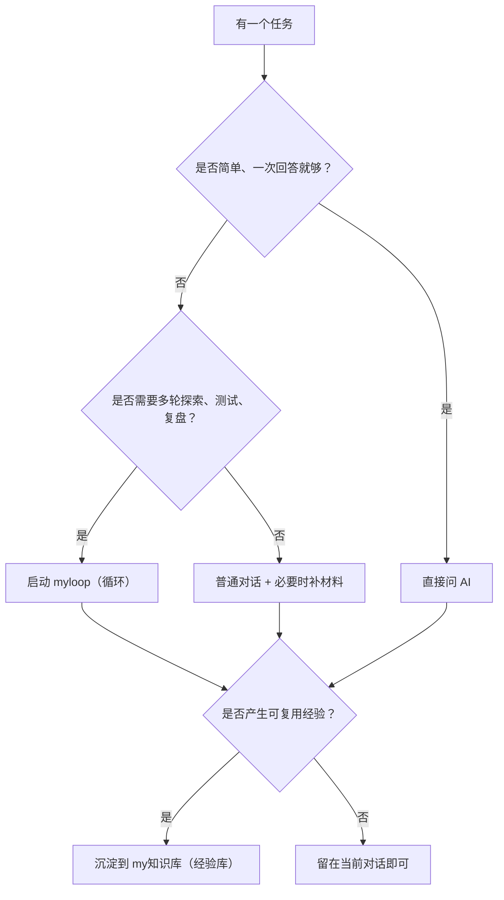

# 个人 AI 操作系统

## 适用场景

当目标不是单次问答，而是长期提升“用 AI 提效、学习 AI、沉淀经验、形成自我迭代飞轮”时，先读这页。

这页适合回答：

- 我桌面的 `myskill`、`myloop`、`my知识库` 分别该怎么用？
- 哪些规则写进 `AGENTS.md` 或 `CLAUDE.md`？
- 什么时候直接问 AI，什么时候启动 Loop（循环），什么时候沉淀到 wiki（维基）？
- 怎么把日常效率提升和学习 AI 结合成复利系统？

## 快速结论

个人 AI 操作系统的最小模型是：

```text
skill（技能）
-> loop（循环）
-> md/wiki（Markdown 文档 / 维基）
-> memory（记忆）
-> better AI use（更会用 AI）
-> faster learning（学得更快）
```

本地三件套分工：

| 层 | 本地位置 | 作用 | 什么时候用 |
| --- | --- | --- | --- |
| skill（技能）入口 | `$HOME/Desktop/myskill` | 给 Codex 一个稳定入口，让它知道该读哪里 | 明确说 `/myloop`、`/my知识库` 或同类触发词时 |
| loop（循环）流程 | `$HOME/Desktop/myloop` | 处理复杂任务，按目标、上下文、探索、评价、复盘推进 | 任务需要多轮分析、测试、复盘或人机对齐时 |
| wiki（维基）沉淀 | `$HOME/Desktop/my知识库` | 保存可复用经验，让下次 AI 和人都能查 | 某条经验下次还会用，能减少重复解释时 |

最重要的原则：

- 简单问题直接问 AI。
- 复杂探索交给 `myloop`。
- 有复用价值的结论沉淀到 `my知识库`。
- 反复出现的规则再提炼成 skill（技能）、Loop（循环）规则、`AGENTS.md` 或 `CLAUDE.md`。

## 标准流程

### 1. 每次任务先分类



判断标准：

- 直接问 AI：概念解释、简单命令、一次性建议、小范围改写。
- 用 `myloop`：目标复杂、上下文多、需要证据、需要评价、可能多轮推进。
- 用 `my知识库`：已经形成稳定经验、路径、排查清单、规则或复盘结论。

### 2. 日常 15 分钟 AI 飞轮

每天只做一个小闭环：

```text
1. 选一个真实问题：今天我想用 AI 解决什么？
2. 判断入口：直接问、跑 myloop，还是准备沉淀？
3. 让 AI 给出结论、证据、风险、下一步。
4. 只挑 1 条最有复用价值的经验写进 my知识库。
5. 记录这条经验以后是否应该升级成 skill 或 loop 规则。
```

不要把知识库当日记。只有“下次能减少重复解释”的内容才值得沉淀。

### 3. 每周一次系统复盘

每周看一次：

```text
1. 本周哪些问题重复出现？
2. 哪些经验可以升级成 wiki 页面？
3. 哪些流程可以升级成 skill（技能）？
4. 哪些复杂任务适合变成 myloop 模板或规则？
5. 哪些稳定偏好应该写进 AGENTS.md 或 CLAUDE.md？
```

复盘目标不是写更多文档，而是让下一周少重复、少跑偏、更快进入状态。

### 4. 持久指令放什么

`AGENTS.md` / `CLAUDE.md` 只放“长期稳定、每次都要遵守”的规则。

适合写：

- 默认用中文。
- 英文专有名词后加中文解释。
- 每次回答加白话总结。
- 复杂概念用白话、类比、例子、Mermaid（流程图）。
- 不默认改文件，除非用户明确要求。
- 遇到 `myskill`、`myloop`、`my知识库` 相关任务，先读本地规则。

不适合写：

- 某个临时任务的细节。
- 很长的 Loop（循环）流程全文。
- 大段 wiki（维基）内容。
- 还没验证过的个人猜想。

## 常见问题

| 问题 | 判断方式 | 处理办法 |
| --- | --- | --- |
| 要不要把所有东西写进 `AGENTS.md`？ | 是否每次任务都必须遵守 | 只写稳定偏好和硬规则，具体流程放 skill / loop / wiki |
| `myloop` 是不是所有任务都要用？ | 是否需要多轮探索、评价、复盘 | 普通问题不要用，复杂任务再用 |
| `my知识库` 要不要记录所有对话？ | 下次是否能复用 | 只沉淀可复用经验，不写流水账 |
| skill（技能）和 loop（循环）区别是什么？ | 是入口还是过程 | skill 是稳定入口，loop 是具体执行流程 |
| 什么时候升级成 skill（技能）？ | 同类流程是否重复 3 次以上 | 重复流程稳定后再做 skill，避免过早抽象 |
| 什么时候写入 memory（记忆）？ | 是否是长期偏好或反复出现的经验 | 可通过 Codex 记忆或知识库沉淀，必守规则仍放 `AGENTS.md` |

## 排查清单

- [ ] 当前任务是否先判断了入口：直接问、`myloop`、还是 `my知识库`？
- [ ] 是否只把可复用经验写进知识库？
- [ ] 是否避免把临时任务细节塞进 `AGENTS.md` / `CLAUDE.md`？
- [ ] 是否每周把重复经验升级成 skill（技能）或 loop（循环）规则？
- [ ] 是否为复杂任务留下结论、证据、风险和下一步？
- [ ] 是否没有为了自动化而过早加脚本、插件或复杂多 Agent（智能体）？

## 相关来源

- `$HOME/Desktop/myskill`
- `$HOME/Desktop/myloop`
- `$HOME/Desktop/my知识库`
- `$HOME/Desktop/my知识库/sources/codex/个人AI操作系统/source.md`
- `wiki/codex/AI Loop工作流设计经验.md`

## 后续可改进

- 把这页沉淀出的稳定偏好同步到 `~/.codex/AGENTS.md`。
- 为 Claude Code 准备一份同等精简的 `CLAUDE.md`。
- 每周复盘一次：把重复任务升级成 skill（技能）或 Loop（循环）模板。
- 未来可以新增“每日 AI 飞轮记录模板”，但不要先把系统做重。

## 白话总结

个人 AI 操作系统不是一个大而全工具，而是一套分工：简单事直接问 AI，复杂事用 `myloop` 深挖，有复用价值的经验写进 `my知识库`，重复出现的流程再升级成 skill（技能）或持久指令。这样 AI 使用才会越用越顺，学习 AI 也会越学越快。
