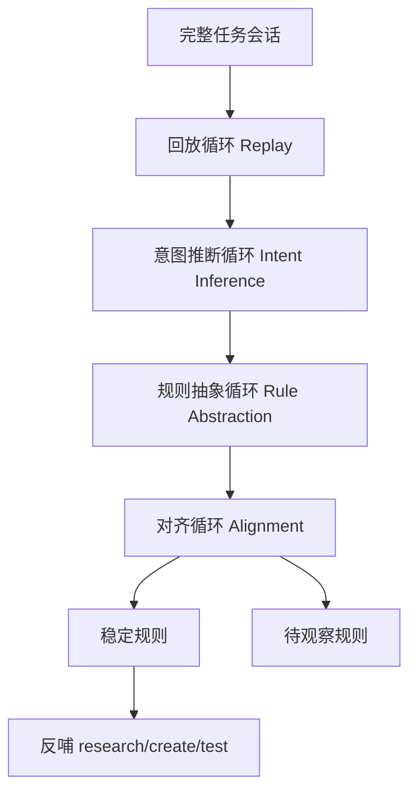

# 元loop设计与落地经验

## 适用场景

适用于想在 `myloop` 里新增一种不直接做任务、而是学习“人怎么带任务”的学习型 Loop（循环）时。

尤其适合下面这类目标：

- 想让 AI 从一次完整任务里学人的提问方式、纠偏方式、收窄方式和确认方式。
- 不想只做一个 skill（技能）入口，而是想做真正的多轮 Loop。
- 想把人的处理方式反哺给 `research/create/test` 等已有 Loop。

## 快速结论

元loop不适合做成单 loop，更适合做成：

```text
一个总控元loop
+ 四个子循环
```

四个子循环分别是：

1. 回放循环：看发生了什么
2. 意图推断循环：看为什么这样发生
3. 规则抽象循环：看哪些模式值得沉淀
4. 对齐循环：和用户确认 AI 学到的是不是“用户自己认可的自己”

一句话：

```text
学工具可以短
学人必须分层
```

## 标准流程

推荐流程是：



对应的执行顺序不能乱：

1. 先回放完整任务流程。
2. 再推断人的意图。
3. 再把意图升维成候选规则。
4. 最后和用户对齐，决定哪些规则真的成立。
5. 把确认后的规则反哺到其他 Loop。

## 为什么不做单 loop

单 loop 最大的问题不是不能做，而是很容易把下面四件事搅在一起：

1. 回放会话
2. 推断动机
3. 抽象规则
4. 验证是否像这个人

这会带来三个风险：

- 明确表达和 AI 推断混掉
- 单次行为过拟合成稳定风格
- 出错时不知道是观察错、推断错，还是抽象错

所以元loop学人时，必须把“事实层”和“解释层”拆开。

## 为什么要有第 4 个对齐循环

前三个子循环最多只能做到：

```text
AI 觉得自己理解了这个人
```

但真正要的不是这个，而是：

```text
AI 学到的是这个人自己认可的自己
```

所以第 4 个循环不能只是冷冰冰做验证，而要多和用户对话，重点确认：

- 哪些规则真的是稳定风格
- 哪些只是当前任务的临时选择
- 哪些地方 AI 理解过头了
- 哪些地方 AI 还没抓到重点

这一步是元loop的核心安全阀。

## 落地方式

最稳的落地方式不是改 `myskill/myloop/SKILL.md`，而是保持 skill（技能）入口稳定，把新场景直接加到 `myloop` 根目录。

这次采用的是：

```text
$HOME/Desktop/myloop/04-meta-loop
```

并保留默认模板入口不变：

```text
$HOME/Desktop/myloop/ai-loop-mini2/loop.md
```

这样做的好处是：

- 不破坏现有 `myloop` skill 的稳定入口
- 元loop能以场景 Loop 身份并入现有体系
- 以后继续演进时，优先改 `myloop`，而不是改 skill 层

## 当前目录结构

这次已经落成的骨架是：

```text
04-meta-loop/
  README.md
  loop.md
  修改记录.md
  00-intake/
  01-replay-loop/
  02-intent-inference-loop/
  03-rule-abstraction-loop/
  04-alignment-loop/
  05-synthesis/
  06-feed-back/
  07-outputs/
  99-skills/
```

其中：

- `00-intake/`：定义学哪段完整任务
- `01-04`：四个子循环
- `05-07`：汇总、反哺、输出
- `99-skills/`：可参考的 skill 书架

## 99-skills 的作用

`99-skills/` 不是元loop本身，也不是执行入口。

它的作用只是辅助元loop查事实，比如：

- `my知识库`
- `internal-knowledge-skill`
- `openai-docs`
- `skill-check`

要点是：

- 元loop可以借这些 skill 查证据
- 但不能把“会用 skill”误当成“已经学会这个人”

## 常见问题

| 问题 | 判断方式 | 处理办法 |
| --- | --- | --- |
| 元loop 是不是一个新的 skill | 看它是不是一句话就能固定触发完 | 不是，它是一个场景 Loop，skill 只是可能的启动器 |
| 第 4 个循环是不是普通测试 | 看它是不是只验证结果对不对 | 不是，它主要校正“学到的人像不像用户自己认可的样子” |
| 能不能只看一次会话就定出稳定规则 | 看这些模式是不是跨任务重复出现 | 第一次只能先形成候选规则，经过对齐后再进稳定规则 |
| 99-skills 会不会喧宾夺主 | 看元loop是不是开始把工具当主体 | skill 只做查事实辅助，真正主体仍然是“学人” |

## 排查清单

- [ ] 有没有把事实、推断、抽象、对齐分层
- [ ] 有没有明确区分“用户明确说过的”和“AI 推断的”
- [ ] 第 4 个循环是不是足够多和用户对话
- [ ] 稳定规则有没有经过用户确认
- [ ] 有没有把这次学到的规则反哺到其他 Loop
- [ ] 有没有把 skill 当成辅助，而不是主体

## 相关来源

- `sources/codex/元loop设计与落地经验/source.md`
- `$HOME/Desktop/myloop/04-meta-loop`
- `$HOME/Desktop/myloop/README.md`
- `$HOME/Desktop/myloop/00-change-log/change-log.md`

## 后续可改进

- 可以补“什么算一轮完整任务”的输入合同。
- 可以增加跨任务对比机制，避免单次会话过拟合。
- 可以后续再决定是否要加一个更冷静的“跨任务验证循环”。
- 可以把元loop确认后的稳定规则分流进 `research/create/test` 三个场景 Loop。

## 白话总结

元loop的关键不是多一个文件夹，而是定下了一条学人的顺序：先回放，再猜原因，再抽规则，最后拿回来给人校正。这样学出来的才更像“你自己认可的你”，而不是 AI 自己脑补出来的你。
