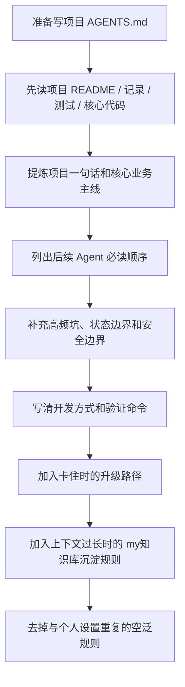

# 项目 AGENTS 文档生成建议

## 适用场景

当一个项目会被 Codex（代码助手）反复进入、反复改代码、反复解释流程时，适合写项目级 `AGENTS.md`。

它解决的问题是：后续 Agent（智能体）进入项目后，不要每次都从零猜项目结构、业务主线、历史坑、测试方式和安全边界。

不适合把项目 `AGENTS.md` 写成通用个人偏好的复制版。个人偏好可以少量继承，项目文档要重点讲“这个项目为什么特别、怎么改才稳”。

## 快速结论

项目 `AGENTS.md` 应该像一份“项目交接和操作规约”，优先写这些内容：

- 项目一句话：这是什么系统，服务谁，主链路是什么。
- 先读顺序：进入项目后先看哪些记录、代码、测试和历史沉淀。
- 核心业务流程：用主线和旁路讲清真实运行方式。
- 高频风险点：状态、并发、回调、按钮、缓存、权限、外部依赖等容易踩坑的位置。
- 开发方式：普通小修怎么做，复杂任务什么时候用 myloop（循环）。
- 测试验证：常用命令、最小测试集、如何区分本地通过和线上生效。
- 边界安全：哪些事不能自动做，哪些敏感信息不能读、写、泄露。
- 卡住升级路径：先查文档和知识库，再查网络经验，最后问用户，不要原地循环。
- 上下文沉淀：上下文太长或结论有复用价值时，先写入 my知识库（本地知识库）。

## 标准流程



## 推荐结构

可以按这个模板组织项目级 `AGENTS.md`：

```md
# AGENTS.md instructions for /path/to/project

<INSTRUCTIONS>

## 角色定位

说明后续 Agent 进入这个项目时扮演什么角色，这份文件是操作规约，不是 README。

## 项目一句话

一句话说明项目是什么、主流程是什么、外部依赖是什么。

## 先读顺序

按优先级列出记录文档、历史 loop、核心入口、提示词、测试。

## 当前核心业务流程

用主线 + 旁路说明项目真实运行流程。

## 高频风险点

列状态、回调、并发、权限、消息格式、外部接口等容易出错的位置。

## 开发方式

说明普通任务和复杂任务怎么分流，什么时候用 myloop，什么时候更新记录。

## 测试和验证

列最常用的测试命令，并说明什么算本地通过，什么算线上生效。

## 边界和安全

列不要自动做的动作，以及敏感信息处理要求。

## 卡住时怎么办

不要原地循环。按顺序查项目文档、my知识库/历史记忆、官方文档、网络经验，仍不确定再问用户。

## 上下文太长怎么办

压缩前先把可复用内容整理到 my知识库 的合适 Markdown；同项目资料尽量集中在同一个项目主题文件夹下，不同任务拆不同 Markdown。

## 回答用户时

说明项目内回答风格，例如先给明确判断、再给证据和风险，最后有白话总结。

</INSTRUCTIONS>
```

## 写作原则

项目 `AGENTS.md` 要少写“永远保持专业”这类泛泛要求，多写可执行检查项。

好的写法：

- “改动消息解析前，先看 `tests/test_infoflow_message_parse.py`，至少跑对应 unittest。”
- “本地验证通过不等于线上生效，回答时必须区分。”
- “遇到连续失败时，先查项目记录和 my知识库，再联网查经验，最后问用户。”

不好的写法：

- “请认真工作。”
- “保持代码质量。”
- “必要时测试。”

## 常见问题

### `AGENTS.md` 和普通 Markdown 有什么区别？

普通 Markdown（文档）主要给人看。项目 `AGENTS.md` 会被 Codex 当作项目级指令重点读取，类似给 Agent 的“本项目操作说明”。所以它应该更短、更硬、更可执行。

### 要不要把个人偏好全复制进去？

不建议。个人偏好适合放在全局设置里，项目 `AGENTS.md` 只继承少量关键项，例如中文回答、白话总结、复杂任务可用 myloop。剩余篇幅应留给项目特有流程、代码入口、测试和风险。

### 项目经验应该放 `AGENTS.md` 还是 my知识库？

稳定且每次进入项目都必须遵守的规则，放 `AGENTS.md`。

长篇复盘、一次性排障过程、可复用但不必每次完整读取的经验，放 my知识库 或 `.project-loops`。

### 上下文快满时怎么办？

先把已经形成的结论、决策、风险、待办整理到 my知识库 的项目主题目录下，再继续任务。这样即使对话压缩，后续 Agent 也能从本地资料恢复上下文。

## 排查清单

写完项目 `AGENTS.md` 后检查：

- 是否有项目一句话，而不是只写个人偏好。
- 是否列了后续 Agent 的先读顺序。
- 是否讲清当前真实业务主线。
- 是否记录了最容易踩坑的状态和外部依赖。
- 是否有常用测试命令。
- 是否说明本地验证和线上生效的区别。
- 是否写了不要自动部署、不要碰真实凭证等安全边界。
- 是否写了卡住时查文档、查 my知识库、联网、问用户的升级路径。
- 是否写了上下文过长时先沉淀到 my知识库。
- 是否删掉了空泛、不可执行、和个人设置高度重复的句子。

## 相关来源

- `$HOME/Desktop/my知识库/sources/codex/项目AGENTS文档生成建议/source.md`
- `$HOME/Desktop/示例业务项目/AGENTS.md`
- `$HOME/Desktop/my知识库/wiki/codex/个人AI操作系统.md`

## 后续可改进

- 如果多个项目都要生成 `AGENTS.md`，可以把本页进一步提炼成 myskill（技能）或模板。
- 可以为“项目导览 -> AGENTS 生成 -> my知识库沉淀”设计一个轻量 myloop。
- 后续可以沉淀更多项目级 `AGENTS.md` 示例，形成不同项目类型的模板。

## 白话总结

项目 `AGENTS.md` 不是把你的个人设置再抄一遍，而是告诉后续 Codex：“这个项目怎么读、怎么改、哪里危险、怎么验证、卡住时先去哪找答案。”
