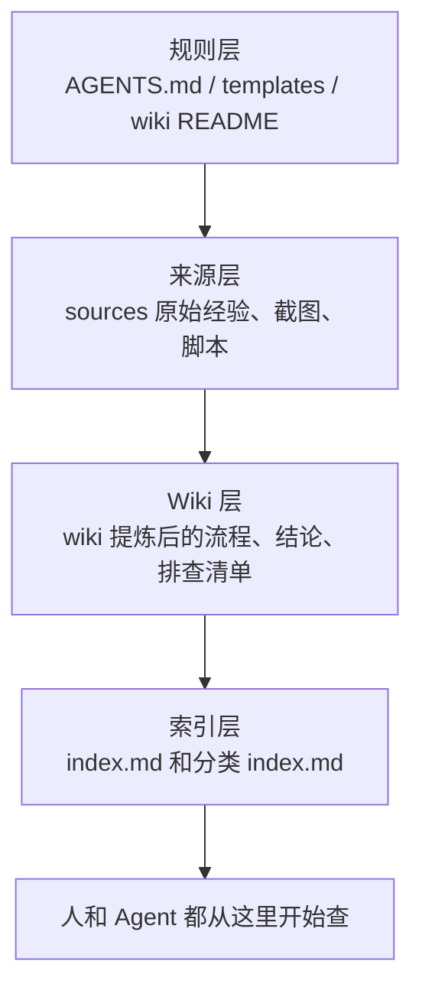
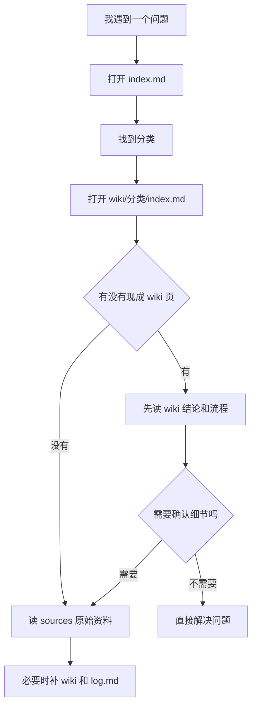
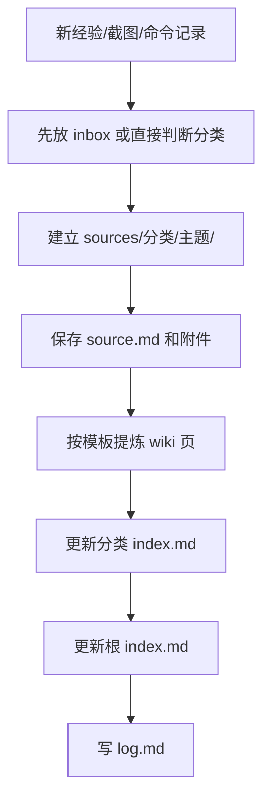

# 经验库说明：把日常经验变成可进化的 Wiki

这份文档给人看，说明这个经验库为什么这样设计、怎么使用、以后怎么更新。

## 一句话说明

这个目录以后不是普通文件夹，而是一个本地私有 LLM Wiki（大语言模型维基）。

它的目标是：

- 原始经验不丢。
- 总结后的知识好查。
- Agent（智能体）进来能自己读规则、找资料、更新索引。
- 后续可以逐步进化成一个经验库 skill（技能）。

## 核心思考

以前的经验文档常见问题是：

1. 新文件越来越多，不知道先看哪个。
2. 截图和文章分开后，时间久了不知道属于谁。
3. 成功结论和失败过程混在一起，查问题时太慢。
4. 下一个 Agent 不知道这个目录的规则，只能重新摸索。

所以现在分成三层：




## 现在的目录怎么理解

```text
my知识库/
  AGENTS.md        # Agent 维护规则
  index.md         # 总入口
  log.md           # 更新记录
  roadmap.md       # 后续改进计划
  经验库说明.md     # 给人看的说明

  sources/         # 原始资料
  wiki/            # 整理后的知识页
  templates/       # 模板
  inbox/           # 临时资料入口
```

白话理解：

- `sources/` 像“证据库”，保存原始记录。
- `wiki/` 像“说明书”，保存整理后的答案。
- `index.md` 像“地图”，告诉你去哪找。
- `AGENTS.md` 像“规矩”，告诉 Agent 怎么维护。

## 为什么 sources 下面还要分文件夹

因为一份经验常常不只有一篇 Markdown，还会有图片、脚本、配置片段。

例如 Mac 基础入门：

```text
sources/daily/Mac基础使用入门/
  source.md
  mac-keyboard-keys.png
  mac-find-file-path.png
  mac-terminal-tabs-windows.png
```

这样做的好处是：文章和图片永远在一起，不容易丢。

## 命名原则

经验库优先给人和 Agent（智能体）阅读，所以目录和文件名尽量用中文。

推荐：

```text
sources/codex/团队接口规范/
wiki/codex/团队接口规范.md
sources/daily/Mac基础使用入门/
```

不优先推荐：

```text
sources/codex/baidu-tech-spec/
wiki/codex/baidu-tech-spec.md
```

英文专有名词不用硬翻译，例如 Codex、Claude Code、QAC、DevOps 可以保留。外部系统 ID、KU（知识库）文档 ID、脚本必须依赖的英文路径也可以保留，但最好放在中文主题目录下面。

## 分类规范

当前按这几类分：

| 分类 | 放什么 |
| --- | --- |
| `codex` | Codex Desktop、Codex CLI、模型服务、Chrome 读取 |
| `claude-code` | Claude Code、Claude Agent、Claude 操作远程环境 |
| `daily` | Mac、终端、快捷键、文件路径等日常经验 |
| `vm` | 虚拟机、SSH、远程机器、隧道、连接工具 |
| `troubleshooting` | 跨工具故障排查和排错清单 |

关键点：虚拟机经验单独放 `vm`，因为 Codex 和 Claude Code 都会用到它。

## 查资料的流程




## 新增经验的流程



## Wiki 页面应该长什么样

后续每篇正式 wiki 页大概这样：

```md
---
title:
category:
type: wiki
updated_at:
source_refs:
sensitivity:
status:
---

# 标题

## 适用场景

## 快速结论

## 标准流程

## 常见问题

## 排查清单

## 相关来源

## 后续可改进

## 白话总结
```

这个格式的重点是：先给结论，再给步骤，最后给证据来源。

## 更新记录怎么写

每次明显改动都写到 `log.md`：

```md
## 2026-06-10

- 新增某个 source。
- 从某个 source 提炼某个 wiki。
- 更新某个分类索引。
```

不用写太细，但要让以后的人知道“为什么目录变了”。

## 敏感信息怎么处理

这个库里有内网、SSH、认证、虚拟机、模型服务等信息，所以默认当私有库处理。

敏感等级：

| 等级 | 含义 |
| --- | --- |
| `public` | 可以公开 |
| `private` | 个人或本机相关，不建议公开 |
| `sensitive` | 涉及内网、令牌、密钥、账号、机器、SSH 等 |

原则：

- 原始细节放 source。
- wiki 只提炼流程和判断方式。
- 不把 token（令牌）、key（密钥）、密码、私钥复制到 wiki。
- 对外分享前必须先脱敏。

## Agent 应该怎么自我改进

这个经验库允许 Agent 小步改进，但不要乱进化。

可以直接做：

- 补索引。
- 修链接。
- 补更新时间。
- 按模板新增 wiki。
- 从 source 提炼排查清单。

需要先问用户：

- 大规模改目录。
- 删除 source。
- 合并分类。
- 改敏感信息规则。
- 做成真正 Codex skill（技能）。

## 当前状态

现在已经完成：

- 建好 `sources/`、`wiki/`、`templates/`、`inbox/`。
- 原始资料已经移动到 `sources/`。
- 建好根目录索引和分类索引。
- 建好 Agent 规则和模板。

还没有完成：

- 还没有逐篇把 source 提炼成正式 wiki 页面。
- 还没有给旧 source 全部补 front matter。
- 还没有做自动检查脚本。

## 白话总结

这个经验库的核心就是：原文放 `sources`，答案放 `wiki`，目录放 `index`，规矩放 `AGENTS`。以后不管是你自己查，还是 Agent 来维护，都先按目录走，不要在一堆文件里瞎翻。
